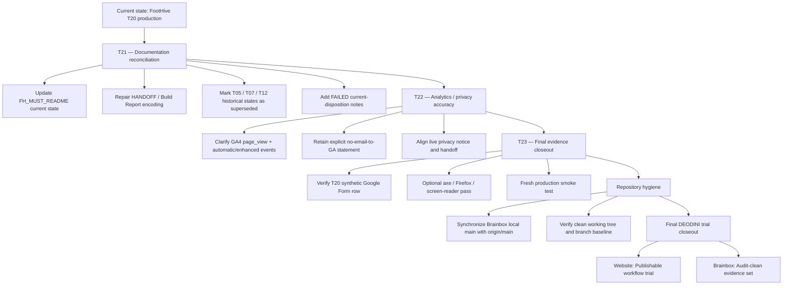
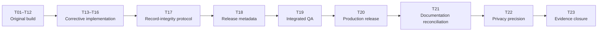

# DEODINI Brainbox and FootHive Deep Audit

## Executive summary

The audit finds a clear split between the **FootHive website itself** and the **project-record layer around it**.

**FootHive runtime status:** **PASS — publishable as a DEODINI workflow trial, with one privacy/analytics wording correction and one T20 verification item worth closing.**

**DEODINI Brainbox / FootHive documentation status:** **NOT YET AUDIT-CLEAN.** The largest remaining problems are stale mandatory documentation, historical statements that were later superseded but are still presented without enough current-state context, encoding corruption in `HANDOFF.md` and the Build Report, and a local Brainbox `main` ref that is behind its remote.

**Structural redevelopment is not required.** The T13–T20 corrective cycle worked: the commercial-placeholder problem, trial disclosure, Pinterest semantics, favicon, optimistic Google Forms success message, accessibility interaction work, social metadata, integrated QA, and final deployment were all addressed.

The highest-severity current finding is **not a website bug**. It is this:

> `FH_MUST_README.md`, the document intended to tell future agents the current FootHive state and reading order, still describes the website as not started and the Build Report as empty.

That is dangerous for the workflow because a future AI agent following the mandatory README could make decisions based on a pre-T01 state even though FootHive is already at T20 production.

The most important website-facing ambiguity is narrower:

> The production privacy notice says GA4 “records a standard page view,” while the T19 evidence shows GA4 also emitted a `form_start` event. The code does not explicitly send form values or email to GA4, and the recorded `form_start` contained structure metadata only, but the privacy wording should acknowledge possible automatic/enhanced GA4 interaction events rather than implying page-view-only collection.

The final production Google Forms test also remains technically incomplete at one evidence point: `t20-test@example.com` received HTTP 200 from Google Forms and loaded the response iframe, but the T20 record still says Operator confirmation of that specific response row is pending. Earlier persistence has already been proven by Operator inspection—including the T14 synthetic test—so this is a **T20 closeout-evidence gap, not evidence that the form is broken**.

### Overall disposition

| Area | Audit disposition |
|---|---|
| FootHive runtime architecture | **PASS** |
| T01–T20 implementation chain | **PASS with documented historical failures/recoveries** |
| Final public T20 deployment | **PASS** |
| Trial/commercial disclosure | **PASS** |
| Pinterest-link semantics | **PASS** |
| Favicon/current production resources | **PASS** |
| Google Forms current implementation | **PASS with T20-specific row confirmation outstanding** |
| GA4 code | **PASS** |
| GA4/privacy wording | **NEEDS CLARIFICATION** |
| Reduced motion | **PASS** |
| Core semantic/accessibility implementation | **PASS within tested scope** |
| Formal WCAG/screen-reader certification | **NOT ESTABLISHED** |
| Browser coverage | **PARTIAL — not comprehensive** |
| FootHive repository topology | **PASS; feature branches intentionally cleaned up** |
| Brainbox documentation integrity | **NEEDS REMEDIATION** |
| Brainbox local `main` synchronization | **NEEDS RECONCILIATION** |
| Entire trial ready to be shown as portfolio/workflow evidence | **YES, after documentation cleanup; website itself is already suitable as a trial publication** |

## Audit scope and evidence

The primary evidence inspected was the live workspace rather than reconstructed memory.

The FootHive repository examined was:

`C:\Users\USER\FOOTHIVE`

The Brainbox source was recursively indexed under:

`C:\Users\USER\DEODINI_BRAINBOX`

with particular emphasis on:

- `FOOTHIVE_PROJ_BRAINBOX\BUILD_REPORT_FH_BRAINBOX.md`
- `FOOTHIVE_PROJ_BRAINBOX\FAILED_FH_BRAINBOX.md`
- `FOOTHIVE_PROJ_BRAINBOX\PASSED_FH_BRAINBOX.md`
- `FOOTHIVE_PROJ_BRAINBOX\FH_MUST_README.md`
- `FOOTHIVE_PROJ_BRAINBOX\CONVO_FH_BRAINBOX.md`
- `C:\Users\USER\FOOTHIVE\HANDOFF.md`
- `index.html`
- `css/styles.css`
- `js/main.js`
- `js/analytics.js`
- image/logo/social assets
- QA evidence/logs
- local Git refs
- GitHub repository state
- production HTML at the public Netlify site.

The public FootHive HTML was fetched directly from the production endpoint during this audit. It contains the current T13–T20 trial disclosure, Pinterest wording, privacy/store dialogs, social image metadata, form hardening, and accessibility additions. The public `/favicon.ico` currently resolves as an icon resource; the historical local favicon 404 should therefore **not** be treated as a current production defect.

### Current FootHive revision state

The local FootHive checkout points to:

```text
main
de648c8c591f7c50b148269dd56156731917543e
```

and the GitHub `main` reference matches that commit. The GitHub repository now exposes only `main`; the T01–T20 feature branches were cleaned up after integration rather than remaining as active remote branches. Their history remains represented through commits, merges, PR references and handoff records. The current remote branch list corroborates the post-release cleanup state. fileciteturn8file0L2-L10

The actual T20 production deployment was recorded against:

```text
1916fc59a38bf84125e966e0f2008b4e78749653
```

A GitHub comparison from the deployed commit to current `main` found current `main` only two commits ahead, and the **only changed project file is `HANDOFF.md`**. Therefore, application HTML/CSS/JS/assets on current `main` have not diverged from the T20 deployed runtime through those post-deployment commits.

That rules out the previous concern that production might still be materially behind the final runtime code.

### Current Brainbox revision state

The Brainbox workspace is currently checked out to:

```text
codex/brainbox-workflow-evidence-update
a81ff175ec5ab49d4bbdac4bc7c8c5fbde95f142
```

and that branch matches its GitHub counterpart.

However:

```text
local main:
f7a630bcf6d558efc80070f41494205fcca284fd

origin/main / GitHub main:
c5f269212919ebdc246144e2d5ce3fe1fc6161d5
```

The local Brainbox `main` reference is therefore **two commits behind the remote main**. The checked-out evidence branch is not itself stale, but an agent switching to local `main` without first synchronizing could work from an outdated Brainbox baseline. The remote Brainbox branch state also preserves dedicated T17–T20 records/evidence branches. fileciteturn17file0L2-L10

### Completeness boundary

This was a recursive workspace index plus intensive content audit of the authoritative project records, runtime source, Git history, production output and QA evidence. Binary images were checked as assets/references rather than semantically reinterpreted pixel-by-pixel, and every historical conversational line in the large chronological transcript was not independently re-litigated. `CONVO_FH_BRAINBOX.md` is deliberately chronological and contains old states that were true at the time; it should not be normalized as though every historical sentence must describe T20.

No shell execution interface was available through the connected desktop tool in this run, so an independent `git status --porcelain` and fresh SHA-256 calculation of every local file were **not** performed. Git references, GitHub comparisons, repository trees and direct file inspection were used instead. Accordingly, I do not claim that a fresh shell-level working-tree cleanliness test was independently established.

## Detailed flagged-items register

The table distinguishes **actual current defects**, **documentation integrity defects**, **historical-but-superseded statements**, and **verification limitations**. A historical failure is not relabeled as a runtime bug merely because it remains preserved in the record.

| Location / branch | Line or evidence | Issue | Severity | Assessment | Suggested correction | Mapping |
|---|---|---|---|---|---|---|
| `FOOTHIVE_PROJ_BRAINBOX\FH_MUST_README.md` | Early current-status/read-order section; also around the file inventory where Build Report is described as “currently zero bytes” | **Mandatory README is materially stale** | **HIGH** | It still describes the website build as not started / future work and Build Report as empty, although T20 is deployed. This can misdirect the next AI agent. | Replace the current-state summary with T20 status. Preserve the original pre-build state only under an explicitly historical section. Update reading order to say Build Report is now authoritative implementation history. | **New T21 — Brainbox documentation reconciliation** |
| `FOOTHIVE\HANDOFF.md` | Near line 8: “Preview destinations: Shop and Instagram currently use…” | Stale social/destination statement | **MEDIUM** | T15 intentionally converted all relevant semantics to Pinterest. There is no real Instagram requirement in this trial. | Change current summary to “Pinterest is the approved trial/reference destination; no FootHive Shopify or Instagram account exists for this trial.” Preserve historical T02/T12 wording below as chronology. | T21 |
| `FOOTHIVE\HANDOFF.md` | Early T02/T05 records: `T02 �`, `1877def �`, `�BUILT TO LAST,�`, viewport `1440�900`, `T01�T05` | Character-encoding corruption | **MEDIUM** | Genuine mojibake remains in a primary handoff record. | UTF-8 repair pass replacing only corrupted characters where intended source is unambiguous; do not alter wording/history. | T21 |
| `BUILD_REPORT_FH_BRAINBOX.md` | T19 area around line ~2293: viewport text containing replacement characters such as `320�780`; other `�` occurrences | Character-encoding corruption | **MEDIUM** | Same documentation-quality defect exists in the formal build record. | Surgical UTF-8 cleanup with before/after diff. | T21 |
| `FOOTHIVE\HANDOFF.md` | T05 section and old overall summary: “Final copy approval remains…” | T05 approval state is stale | **MEDIUM** | Operator, acting as Client, later explicitly approved the T05 copy. T05 is closed. | Add an explicit supersession note next to the old pending language: “Superseded: Operator approved T05 on [recorded timestamp].” Do not erase the original historical state. | T21 |
| `FOOTHIVE\HANDOFF.md` | Early T07 section says form includes a “success state” | Historical T07 behavior is no longer current | **MEDIUM** | T14 deliberately removed the unsupported “You’re on the list” certainty. Current code truthfully says storage cannot be verified cross-origin. | Mark early T07 “success state” description as historical and superseded by T14 hardening. | T21 / T14 documentation follow-up |
| `FOOTHIVE\HANDOFF.md` | T12 “Replace trial links with final destinations”; Shopify/Instagram instructions around lines ~189–196 | Superseded release assumption | **MEDIUM** | Operator later established that there is no real Shopify/Instagram for this trial; T15 intentionally standardized Pinterest. | Keep as historical T12 instruction but attach clear “superseded by T13/T15 trial decision” marker. | T21 |
| `FOOTHIVE\HANDOFF.md` | T18 release-state wording still mentions final Shopify/Instagram inputs | Superseded by T15/operator clarification | **LOW–MEDIUM** | No longer an outstanding input for the trial. | Add supersession note or rewrite only the current-state sentence. | T21 |
| `FOOTHIVE\HANDOFF.md` | T12 GA4 section: “single configuration is `measurementId`” | Variable-name documentation mismatch | **LOW** | Actual JavaScript variable is `FOOT_HIVE_GA_MEASUREMENT_ID`. | Correct the identifier to the exact source variable. | T21 |
| Production privacy dialog + `js/analytics.js` + T19 Build Report | Live text: “Google Analytics 4 records a standard page view.” T19 records a `form_start` request returning 204 | **GA4 privacy wording is incomplete/ambiguous** | **MEDIUM** | Custom code does not submit email/form values, but GA4 enhanced/automatic measurement can produce interaction events such as `form_start`. “Records a standard page view” can be read too narrowly. | Change notice to: “GA4 records page views and may record standard/enhanced interaction events such as form-start metadata. FootHive does not send the email field value to GA4.” Mirror that distinction in HANDOFF/Build Report. | **New T22 — Analytics/privacy accuracy** |
| `FOOTHIVE\HANDOFF.md`, old T08 language | “standard page view only” style wording vs recorded `form_start` | Analytics documentation overstates page-view-only behavior | **MEDIUM** | The custom implementation only explicitly calls GA config/page view, but Google can emit automatic enhanced events. | Distinguish **custom FootHive events** from **Google automatically collected/enhanced events**. | T22 |
| `BUILD_REPORT_FH_BRAINBOX.md` | T20 “Public notification form test” around lines ~2332–2336 | T20-specific response-row confirmation still pending | **LOW–MEDIUM** | Production POST returned HTTP 200 and iframe response loaded, but the record says the Operator has not yet confirmed `t20-test@example.com` in the response sheet. Earlier T14 persistence is already proven. | Operator inspects Google Forms responses once and adds a dated T20 confirmation. If absent, record that accurately and investigate. | **New T23 — Final evidence closeout** |
| `BUILD_REPORT_FH_BRAINBOX.md` | Earlier final-release list around ~1711 | Formatting defect: list items 4/5 were joined physically | **LOW** | Does not alter runtime or substantive conclusion but reduces archival quality. | Repair line break only. | T21 |
| `FAILED_FH_BRAINBOX.md` | Early “Phase state” / build-state material | Failure log lacks enough current disposition around some old open flags | **MEDIUM** | Failure history should remain untouched, but several conditions later resolved by T13–T20 can look current without a disposition. | Add a “Current disposition as of T20” layer identifying each resolved, superseded or still-open item. Never delete original failure records. | T21 |
| `FAILED_FH_BRAINBOX.md` | Earlier Google Forms persistence/open-state language | Superseded by later Operator evidence | **LOW–MEDIUM** | Operator later confirmed four responses including `t14-test@example.com`; old uncertainty remains historically valid but is no longer current. | Add adjacent resolution pointer to T14 evidence. | T21 |
| Brainbox Git refs | local `main=f7a630b…`; remote `main=c5f2692…` | Local `main` is behind remote by two commits | **MEDIUM** | Checked-out evidence branch matches remote; risk arises only when future work switches to stale local main. | Before next Brainbox task: preserve work, switch to `main`, `git pull --ff-only origin main`, verify, then branch from synchronized baseline. | **T24 — Repository hygiene**, or workflow maintenance outside website tickets |
| Production HTML | Netlify adds a HUD script/comment after repository HTML | Served HTML is not byte-for-byte identical to source | **INFO / LOW** | Platform injection, not evidence of FootHive code divergence. Runtime application source otherwise matches T20. | No required fix. Disable Netlify HUD/auxiliary injection only if exact-source HTML is an explicit portfolio requirement. | Optional T23 |
| Public trial notification form | Warning says “Do not submit a personal email address,” but public visitor can still submit one | Residual public-data risk | **LOW / ACCEPTED TRIAL RISK** | Privacy notice discloses Google Forms processing and removal contact. The form is intentionally retained to demonstrate integration. | Keep current disclosure, or disable submission if the trial is ever intended to become purely static portfolio display. | T22 optional |
| T16/T19/T20 QA | No formal WCAG/axe audit or screen-reader test; final T20 pass is Chromium-based | Verification coverage gap | **LOW–MEDIUM** | Not a demonstrated accessibility failure. Existing source/keyboard work is good, but “fully WCAG compliant” would be unsupported. | Optional final axe + screen-reader smoke test; continue to describe accessibility as tested within scope rather than certified. | **T23** |
| Browser matrix | T11 covered Chrome + Edge; later final T20 is Chromium. Firefox/Safari not established | Cross-browser evidence incomplete | **LOW** | No current regression observed. Do not claim universal browser certification. | Optional Firefox pass; Safari only when actual environment/service is available. | T23 |
| Historical evidence logs | Google Forms `ssl.gstatic.com/...cleardot.gif` DNS errors; Netlify API favicon 404 | Third-party diagnostic noise | **INFO — NOT A CURRENT SITE BUG** | Errors occurred inside Google Forms/Netlify contexts, not the current FootHive page. Production favicon now resolves. | Keep evidence; label third-party context so future agents do not reopen resolved favicon bug. | T21 documentation clarification |

### Important items that were investigated and ruled out

Several earlier flags should **not** be reopened as current defects.

**The favicon is resolved in production.** The current page declares `assets/logo/favicon.svg`, and a direct public request to `/favicon.ico` returned an icon resource. The old localhost implicit `/favicon.ico` 404 remains useful historical evidence but is not a T20 production bug.

**Pinterest is not a placeholder waiting for Shopify anymore.** For this trial, it is the intentionally approved footwear/reference destination. The current site tells visitors this explicitly.

**Instagram is no longer mislabeled.** The current live footer says “Pinterest footwear references.”

**Returns and shipping are no longer presented as real commercial promises.** The live site explicitly says the $75 offer is illustrative sample copy, no orders are fulfilled, and FootHive is not an operating store.

**The T07/T14 field mapping should not be changed.**

```text
entry.1045781291
```

is the confirmed mapping. The earlier diagnosis suggesting a field-name mismatch was superseded by the documented clarification and Operator response evidence.

**The optimistic T07 success-message weakness is fixed.** Current JavaScript does not equate iframe load with confirmed Google Forms persistence.

**The T08/T09 ticket mismatch is historically contained.** It is a process failure worth retaining, not a current branch/scope problem.

**T05 is closed.** The Operator explicitly approved the Story copy as Client for the trial.

**No current FootHive application-code divergence was found between the deployed T20 runtime revision and present `main`.** The two commits after the deployed commit change only `HANDOFF.md`.

## Runtime, privacy, accessibility and publication assessment

### Production HTML is now trial-appropriate

The public page contains a visible:

> “A DEODINI workflow trial build · not a live footwear store.”

The Shop/Pinterest semantics no longer imply Shopify or Instagram.

The shipping text is qualified:

```html
<p class="hero__note">
  Illustrative $75 shipping offer · workflow trial only
</p>
```

and the Trust section explicitly describes the offer as sample copy.

The store-information dialog says, in substance:

```text
FootHive is not an operating shop.
No orders are accepted or fulfilled.
The free-shipping line is illustrative.
No shipping offer or returns policy is active.
Pinterest is the supplied reference destination.
```

That is the correct adaptation for the Operator's stated trial purpose.

### Google Forms behavior is now technically honest

The form remains:

```html
action="https://docs.google.com/forms/d/e/.../formResponse"
name="entry.1045781291"
```

but the public consent text now says:

```text
Workflow trial form only. Do not submit a personal email address.
```

Current `main.js` also uses a conservative response model:

```text
submit
  ↓
button disabled / pending
  ↓
iframe load OR timeout
  ↓
site explicitly says it cannot verify Google-side storage
```

That is materially better than the original T07 behavior.

T14 independently established persistence through Operator inspection of Google Forms Responses, including the synthetic:

```text
t14-test@example.com
```

The remaining T20 item is merely to confirm whether the later:

```text
t20-test@example.com
```

row was stored after the final production test.

### Analytics implementation is technically narrow, but documentation should be more precise

Current `analytics.js` uses one public Measurement ID:

```text
G-8WM4JZKBNR
```

and a single source variable:

```js
FOOT_HIVE_GA_MEASUREMENT_ID
```

with:

- placeholder protection;
- duplicate-init guard;
- `dataLayer`;
- `gtag`;
- asynchronous Google tag loading;
- `send_page_view: true`;
- no custom code reading the notification email;
- no FootHive custom analytics event containing the email address.

The privacy concern is therefore **not that FootHive is leaking the email field into GA4**.

The issue is documentation precision.

T19 recorded that a GA4 `form_start` event also occurred. That is consistent with Google's automatic/enhanced measurement behavior even when FootHive itself does not write a custom `form_start` event.

Therefore the strongest wording is:

> **FootHive's custom analytics code configures GA4 and does not send notification-form field values. GA4 may also produce standard automatically collected or enhanced interaction events such as `form_start`; those events must not contain the entered email address.**

This wording eliminates the ambiguity without inventing a privacy failure.

### Accessibility implementation is structurally strong for the MVP

The current implementation contains:

- skip navigation;
- semantic header/navigation/main/sections/footer;
- one logical H1;
- H2/H3 hierarchy;
- explicit form label;
- form live status;
- descriptive image alternatives;
- dialog labels/descriptions;
- keyboard-closeable native dialogs;
- focus restoration;
- visible focus handling;
- new-tab context conveyed to assistive technology;
- reduced-motion treatment;
- mobile-first responsive structure.

T16 reported:

```text
0 duplicate IDs
0 broken internal anchors
20/20 outbound links with safe rel/new-tab descriptions
9/9 images with alt text
7/7 product images with dimensions
```

and Playwright keyboard testing confirmed skip-link focus and modal Escape behavior.

This supports an **accessibility-conscious implementation pass**.

It does **not** support statements such as:

> “WCAG certified”

or:

> “fully accessible across all assistive technologies.”

No formal screen-reader or comprehensive WCAG conformance audit was performed.

### Reduced motion is correctly handled

The stylesheet includes reduced-motion protections and only enables hover transforms in appropriate pointer/motion environments. The T10/T16 motion architecture therefore remains a pass; I found no reason to reopen it.

### Console/network evidence does not expose a current FootHive failure

Historical evidence includes Google Forms resource warnings and DNS failures for Google's own tracking/resource URLs, as well as a Netlify API favicon request returning 404.

Those logs should not be interpreted as current FootHive application errors.

T20's fresh production browser pass recorded no page console errors/warnings, and the direct audit confirms the current favicon fallback resolves.

### Security profile is proportionate to the trial

The site has:

- no authentication;
- no custom database;
- no backend;
- no payments;
- no cart;
- no secrets embedded beyond public service identifiers/endpoints;
- `noopener noreferrer` on new-tab Pinterest links;
- no user-supplied HTML rendering;
- no custom analytics submission of the email field.

The Google Forms URL and GA4 Measurement ID are public integration identifiers, not secrets.

The largest privacy consideration is simply that a public visitor could ignore the warning and type a real address into the Google form. That risk is now disclosed and a removal contact is provided. For the stated trial/portfolio purpose, I regard this as an accepted low-level residual risk rather than a release blocker.

## Prioritized Operator action plan

The website itself does **not** need another large T13–T20-style corrective cycle. The most efficient next stage is a short closeout sequence focused on records and evidence.

### Immediate priority

**Create T21 — Brainbox / Handoff Documentation Reconciliation.**

This should be a documentation-only ticket.

It should:

1. Update `FH_MUST_README.md` from pre-build status to T20/current status.
2. Repair UTF-8 mojibake in `HANDOFF.md` and the Build Report.
3. Mark T05 approval as closed.
4. Mark old T07 success wording as superseded by T14.
5. Mark old Shopify/Instagram assumptions as superseded by the Operator's trial decision/T15.
6. Correct the GA4 source-variable name in HANDOFF.
7. Add current-disposition annotations to resolved entries in `FAILED_FH_BRAINBOX.md`.
8. Repair the known Build Report joined-list formatting defect.
9. Preserve every historical record rather than rewriting history.

### Privacy/analytics precision

**Create T22 — Analytics and Privacy Accuracy.**

This should be intentionally small.

Change the privacy notice from wording that can be interpreted as “page views only” to wording acknowledging automatic/enhanced events while explicitly saying form field values are not intentionally sent.

Recommended production wording:

> **Google Analytics 4 records page views and may record standard or enhanced interaction events, such as form-start metadata. FootHive does not intentionally send the email address or other notification-form field values to Google Analytics.**

Then align:

- `HANDOFF.md`;
- current-state Build Report summary;
- privacy dialog.

Do not rewrite old T08/T19 observations.

### Evidence closeout

**Create T23 — Final Verification Evidence.**

This should not add features.

The Operator should verify whether:

```text
t20-test@example.com
```

exists in the Google Forms response set.

Then record either:

```text
CONFIRMED
```

or:

```text
NOT FOUND
```

with timestamp.

T23 can also optionally run:

- a final automated accessibility scan;
- Firefox smoke test;
- keyboard pass;
- production console/network smoke test.

These additional checks improve portfolio evidence but are not prerequisites for treating the current trial website as functional.

### Repository hygiene

**Treat Brainbox main synchronization as T24 or routine maintenance.**

Before the next Brainbox development branch begins:

```bash
git switch main
git pull --ff-only origin main
```

after first protecting any current branch work.

The key point is not the literal command; it is that the next branch must not be based on local:

```text
f7a630b...
```

when remote `main` is already:

```text
c5f2692...
```

### Priority matrix

| Priority | Work | Why |
|---|---|---|
| **P0** | T21 mandatory README/current-state reconciliation | Prevents future AI agents from starting from a false project state |
| **P1** | T22 GA4/privacy wording correction | Removes the only meaningful current public-facing ambiguity |
| **P1** | T23 T20 Google Forms row confirmation | Closes the final production form-evidence loop |
| **P2** | Brainbox local `main` fast-forward | Prevents future branch baseline drift |
| **P2** | Encoding/format cleanup inside T21 | Makes audit trail mechanically reliable |
| **P3** | Firefox / axe / screen-reader evidence | Quality enhancement, not demonstrated runtime repair |
| **P3** | Netlify HUD suppression | Optional; not a current functionality problem |

## Remediation flow and batch plan

The remediation should remain ticketed rather than becoming an undifferentiated cleanup.



The chronology should continue to preserve:



### Suggested batching

A further scan can be split without touching production.

**Documentation batch:** `FH_MUST_README.md`, `PASSED`, `FAILED`, Build Report, HANDOFF and cross-document current-state consistency.

**Repository/history batch:** current Git state, commit ancestry, stale local refs, deleted feature-branch evidence and PR/commit mapping.

**Runtime/security batch:** live HTML/CSS/JS, privacy behavior, GA4, Google Forms, external links and Netlify output.

**Accessibility/browser batch:** automated accessibility tooling, keyboard, Firefox/Chromium and optionally a Safari-capable external environment.

This audit substantially completed the first three at the level necessary to identify the highest-confidence defects. The last accessibility/browser batch remains optional additional evidence rather than a known defect-repair batch.

## Reproducibility, revision anchors and inspected hashes

### Exact execution method used

No shell commands were executed during this audit because the connected Desktop Commander configuration exposed filesystem/search/read operations but not a general shell executor.

The equivalent audit operations actually issued were connector calls of these forms:

```text
Remote_Desktop_Commander.list_directory(
  path="C:\Users\USER\FOOTHIVE",
  depth=5
)

Remote_Desktop_Commander.list_directory(
  path="C:\Users\USER\DEODINI_BRAINBOX",
  depth=5
)
```

Recursive file indexing/search:

```text
Remote_Desktop_Commander.start_search(
  path="C:\Users\USER\DEODINI_BRAINBOX",
  pattern=".*",
  searchType="files",
  includeHidden=true
)
```

Encoding searches:

```text
Remote_Desktop_Commander.start_search(
  path="C:\Users\USER\DEODINI_BRAINBOX",
  pattern="�",
  searchType="content",
  filePattern="*.md"
)

Remote_Desktop_Commander.start_search(
  path="C:\Users\USER\FOOTHIVE",
  pattern="�",
  searchType="content",
  filePattern="*.md"
)
```

Documentation-state searches:

```text
pattern =
"final destinations|Shopify|Instagram|pending|uncommitted|unpushed|
 not merged|not deployed|coming soon|favicon.ico"
```

Error/evidence search:

```text
pattern =
"error|warning|404|failed|ERR_|net::|console"
```

T20 form-evidence search:

```text
pattern =
"t20-test@example\.com|response-row|row confirmation|
 T20.*confirmed|confirmed.*T20|response sheet"
```

Primary source reads included:

```text
C:\Users\USER\FOOTHIVE\index.html
C:\Users\USER\FOOTHIVE\css\styles.css
C:\Users\USER\FOOTHIVE\js\main.js
C:\Users\USER\FOOTHIVE\js\analytics.js
C:\Users\USER\FOOTHIVE\HANDOFF.md

...\FOOTHIVE_PROJ_BRAINBOX\BUILD_REPORT_FH_BRAINBOX.md
...\FOOTHIVE_PROJ_BRAINBOX\FAILED_FH_BRAINBOX.md
...\FOOTHIVE_PROJ_BRAINBOX\FH_MUST_README.md
...\AI_BRAINBOX\AI_MUST_README.md
```

The production document was directly fetched as:

```text
Remote_Desktop_Commander.read_file(
  path="https://foothive.netlify.app/",
  isUrl=true
)
```

and favicon fallback was independently requested as:

```text
Remote_Desktop_Commander.read_file(
  path="https://foothive.netlify.app/favicon.ico",
  isUrl=true
)
```

GitHub operations included:

```text
GitHub.get_repo("DeOdini/FOOTHIVE")
GitHub.get_repo("DeOdini/DEODINI_BRAINBOX")
GitHub.fetch(.../branches?per_page=100)
GitHub.fetch_commit(...)
GitHub.fetch(.../git/trees/<tree>?recursive=1)
GitHub.compare_commits(
  base="1916fc59",
  head="de648c8"
)
```

A general web search was also attempted for the public site, but it did not provide useful indexed evidence and was **not** used as the source of the conclusions above. The direct production fetch and repository evidence were preferred.

### FootHive revision anchors

| Object | Revision/hash |
|---|---|
| Current local/GitHub `main` | `de648c8c591f7c50b148269dd56156731917543e` |
| T20 deployed merge | `1916fc59a38bf84125e966e0f2008b4e78749653` |
| Current FootHive tree | `97fa96f807a1ee5ee1d5bc14ecffc1754cda53be` |

### Inspected FootHive file hashes

These are **Git blob SHA-1 object IDs**, which are useful for identifying the exact tracked content inspected. They are not being mislabeled as SHA-256.

| File | Git blob SHA-1 |
|---|---|
| `index.html` | `dc07e64eb4934d3f68f072482b3f444968cb0ecb` |
| `css/styles.css` | `6170c6f56699975fb404553d10ed2987363289a4` |
| `js/main.js` | `da719f3dd936bf649b3f15162d3207067ec7171c` |
| `js/analytics.js` | `5ce0df8ac23787ff8051b806176846e26967f05f` |
| `HANDOFF.md` | `366a4f50c2595368d84d3a7cf6bd7c177145f1fd` |
| `assets/logo/favicon.svg` | `6ff154fa069f2c9ac0631d59a5f51755dd0866d3` |
| `assets/social/foothive-share-card.png` | `81f7825…` |
| `docs/qa/t11/edge-1440x900.png` | `9bc40790…` |
| `docs/qa/t11/edge-320x780.png` | `ef09c320…` |
| `docs/qa/t11/edge-390x844.png` | `59b0ee8c…` |
| `docs/qa/t11/edge-768x1024.png` | `7263b103…` |

A fresh independent SHA-256 manifest was not produced because a local shell/hash executor was not available through the connected tool surface. The commit/tree/blob identities above are therefore the reproducibility anchors actually established in this run rather than invented SHA-256 values.

### Brainbox revision anchors

| Object | Revision |
|---|---|
| Checked-out Brainbox branch | `codex/brainbox-workflow-evidence-update` |
| Checked-out branch tip | `a81ff175ec5ab49d4bbdac4bc7c8c5fbde95f142` |
| Local Brainbox `main` | `f7a630bcf6d558efc80070f41494205fcca284fd` |
| `origin/main` / GitHub main | `c5f269212919ebdc246144e2d5ce3fe1fc6161d5` |
| Current Brainbox branch tree | `5691736b3fd9df41c1aa174768883beb7a28b84b` |

### Final audit judgment

The deep scan does **not** uncover a hidden structural FootHive failure requiring another rebuild.

It instead reveals that the corrective-ticket system did its job:

```text
initial implementation
        ↓
mistakes / ambiguous states discovered
        ↓
failures preserved
        ↓
T13–T16 corrective work
        ↓
T17 process correction
        ↓
T18 metadata
        ↓
T19 integrated QA
        ↓
T20 production
```

The remaining weakness is now concentrated in **record synchronization and precision**, not website architecture.

Accordingly, the final classification is:

> **FOOTHIVE WEBSITE — PASS / PUBLISHABLE AS A DEODINI WORKFLOW TRIAL**

with:

> **ONE PUBLIC-FACING WORDING REMEDIATION RECOMMENDED: GA4 privacy wording**

and:

> **ONE FINAL PRODUCTION EVIDENCE ITEM OUTSTANDING: confirmation of the T20 synthetic Google Forms response row.**

For the broader project:

> **DEODINI BRAINBOX FOOTIVE RECORD SET — CONDITIONAL PASS / DOCUMENTATION RECONCILIATION REQUIRED**

because `FH_MUST_README.md`, several current-state HANDOFF statements, encoding artifacts, historical supersession markers and the stale local Brainbox `main` ref remain inconsistent with the otherwise successful T20 production state.

The logical final cleanup therefore is **T21 documentation reconciliation → T22 analytics/privacy precision → T23 evidence closeout**, followed by Brainbox repository synchronization.