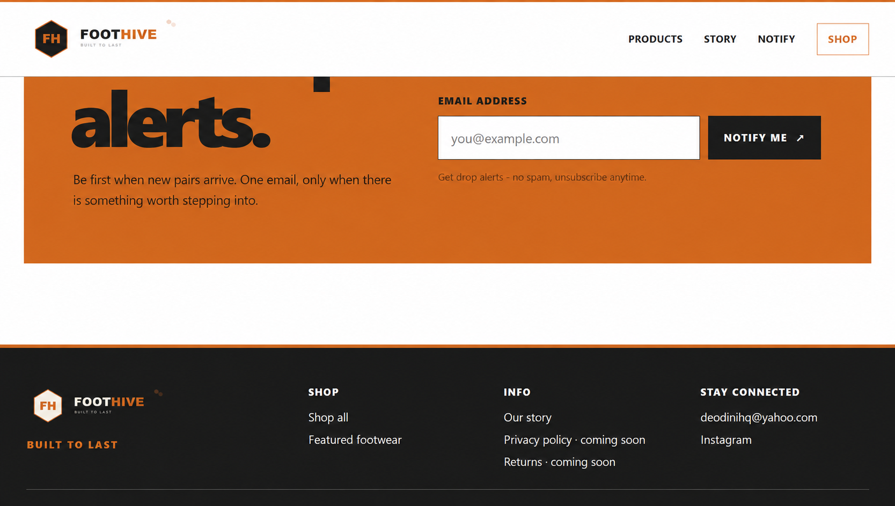
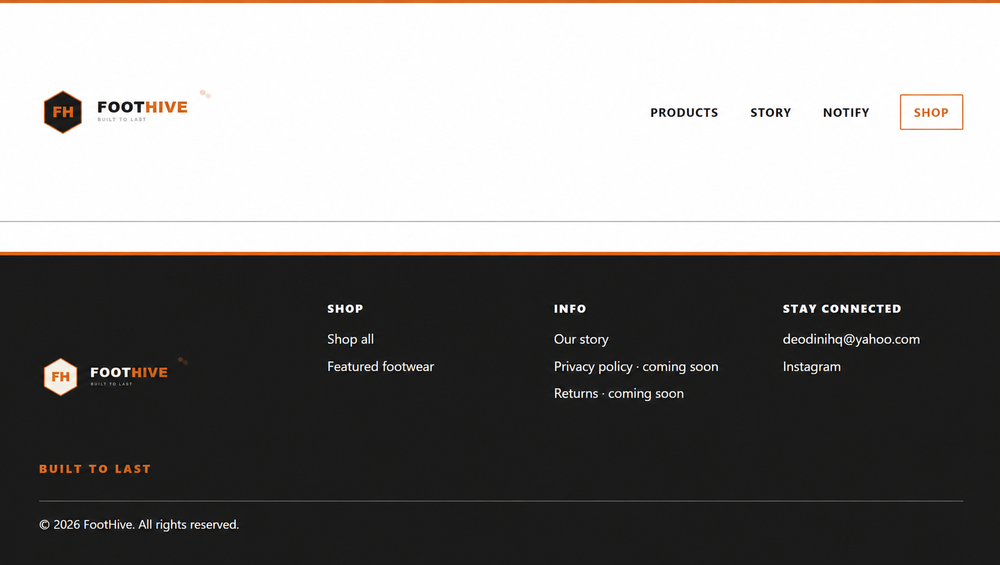

# FootHive Build Report

## T01 — Project shell & design tokens

**Status:** Implemented; pending Claude evaluation  
**Repository:** `C:\Users\USER\FOOTHIVE`  
**Branch:** `t01/project-shell-design-tokens`

### Files and folders created

- `index.html` — HTML5 document, metadata, stylesheet/script references, and placeholder regions only.
- `css/styles.css` — locked palette and design tokens with a minimal reset.
- `js/main.js` — comment-only stub; no interactions added.
- `assets/logo/foothive-logo.svg` and `assets/logo/foothive-logo-dark.svg` — supplied logo variants.
- `assets/products/` — empty folder reserved for a later ticket.
- `HANDOFF.md` — stack, Netlify target, asset paths, and approved preview destinations.

The repository root was used as the site root. No hero copy, product cards, form UI, cart, extra routes, or Direction B styling were added. No flagged product images were copied into the repository. Shop and Instagram preview destinations are documented as `https://pin.it/37MYm0GnG`; link markup belongs to T02.

**Verification:** File and directory presence, branch, and Git status were inspected. Browser/device QA was not run; T01 has not been independently evaluated or marked passed.

---

**Revision note — 2026-09-28 14:23:19 -05:00:** Recorded T01 implementation location and current evaluation status. No verification pass is claimed.
**Agent:** Codex
**Signed & Authorized by: DE O'DINI (OPERATOR)**

---

## T01 — Project shell & design tokens — Claude Evaluation

**Evaluator:** Claude
**Repository checked:** `C:\Users\USER\FOOTHIVE`
**Branch checked:** `t01/project-shell-design-tokens`
**Commit checked:** `522c876` — "T01: add project shell and design tokens"
**Method:** Direct RDC read of all six tracked files, SHA-256 hash comparison of logo assets against the Brainbox source, `git status`/`git log`/`git show --stat` inspection. Static review only — no live browser render was performed.

### Result: **PASS**

| Acceptance criterion (per Grok's T01 ticket) | Result |
|---|---|
| Tree matches architecture intent | Pass — exact match |
| Tokens present and match locked palette | Pass — `#1A1A1A` / `#D2691E` / `#8A8A8A` / `#FFFFFF` / `#FAFAF8` all correct, full spacing scale present |
| `index.html` validates structure regions | Pass — `header`/`main`/`footer` with clearly commented placeholders for hero, products, story, trust, notify |
| No cart, no prices, no extra routes | Pass — none present |
| Opens in browser without console errors | Not independently confirmed by live render (see limitation below); nothing in static review suggests an error |

### Additional verification performed

- `assets/logo/foothive-logo.svg` and `foothive-logo-dark.svg` are byte-for-byte identical (SHA-256 match) to the source files in `FOOTHIVE_PROJ_BRAINBOX/FOOTHIVE LOGO + DARK MODE/`.
- `assets/products/` is genuinely empty — no flagged or unflagged product imagery present, correct for T01 scope.
- `HANDOFF.md` correctly documents the Pinterest placeholder (`https://pin.it/37MYm0GnG`) for both Shop and Instagram, and restates the v1 boundary (no cart/backend/database/auth/extra pages).
- Git state matches exactly what was reported: single clean commit, only the 6 files in scope, nothing pushed.

### Limitation disclosed

This evaluation is a thorough static/structural review, not a live browser QA pass. Rendering and console-error confirmation remain the job of the later cross-browser/device QA ticket (T11), not this evaluation.

### Flag raised during evaluation — process issue, not a code defect

**Commit author identity is incorrect:** `pedestal-archive <deodinihq@gmail.com>`

This is a leftover git identity from a different, unrelated prior project — not FootHive. It is the same "pedestal-archive" project Grok explicitly warned against reusing as this workflow trial's test vehicle, specifically to avoid contaminating results with prior decisions. Having it appear as the commit author in FootHive's own git history is a process error, not a code-quality one, and should be corrected before further commits accumulate under the wrong name.

**Standing instruction for Codex and all AI agents going forward:** Before committing to any project repository, always confirm the active working directory/workspace is the correct, current project workspace — not a similarly named Brainbox records folder, not a leftover or prior project's workspace — and confirm the git author identity configured for that repository is accurate to the current project before committing. Do not assume an inherited git config is correct; verify it.

**Verdict:** T01 passes on code and structure. Cleared to proceed to T02, once the commit-author identity is corrected for this and all future FootHive commits.

---

**Revision note — 2026-09-29:** Added Claude's T01 evaluation (pass) and flagged an incorrect commit-author git identity as a process issue requiring correction before further commits.
**Agent:** Claude
**Signed & Authorized by: DE O'DINI (OPERATOR)**

---

## T02 — Global layout & responsive shell

**Status:** Implemented, committed, and pushed to GitHub; not merged.  
**Repository:** `C:\Users\USER\FOOTHIVE`  
**Branch:** `t02/global-layout-responsive-shell`  
**Commit:** `1877def` — `T02: build global responsive shell`  
**Commit author:** `DeOdini <deodinihq@gmail.com>`

### Changes

- `index.html` — added the responsive site header, supplied light/dark logo usage, Products / Story / Notify / Shop links, anchor targets for later sections, and the dark footer with email, temporary social/shop destinations, policy placeholders, and 2026 copyright.
- `css/styles.css` — added shared page width and spacing, mobile-first header/footer layouts, desktop breakpoint, sticky header, focus-visible styling, and restrained hover states using the approved palette and tokens.
- Kept cart, product cards, story copy, real policy routes, product imagery, and later-ticket integrations out of scope. No flagged product images were added.

### Verification and limitations

The branch was pushed and tracks `origin/t02/global-layout-responsive-shell`. No merge was performed. Chrome inspection confirmed the deployed production page is T01 (`main @ 08228be`); this does not validate T02. No local T02 preview, device viewport matrix, or automated tests were run, so T02 visual verification remains outstanding.

**Revision note — 2026-09-29:** Recorded T02 implementation after push. The earlier T01 section is a historical record and contains its original branch/status references; the current T02 work is on the branch listed above.  
**Agent:** Codex  
**Signed & Authorized by: DE O'DINI (OPERATOR)**

---

### Production deployment check — 2026-09-29

**Production URL:** `https://foothive.netlify.app/`  
**Netlify deploy:** `6abb4a26fd60ef4e247da604`  
**Published source:** `main @ 08228be` (`T01: add project shell and design tokens`)

Chrome inspection found an empty page structure (banner, main, and footer landmarks without visible page content) and no console warning/error entries. The published `main` HTML at `08228be` confirms the header and footer are placeholders and the main area contains only comments. The blank production page is therefore consistent with the T01 version that Netlify published.

T02 (`t02/global-layout-responsive-shell`, implementation `1877def`, handoff commits `f7de17d` and `87a2600`) is still separate from `main` and was not part of this deploy. No merge was performed. This check did not render the T02 branch locally or through a Netlify deploy preview; no device viewport matrix or automated tests were run.


---

## T02 — Global layout & responsive shell — ChatGPT Evaluation

**Evaluator:** ChatGPT  
**Reason for evaluation handoff:** The Operator explicitly handed T02 evaluation from Claude to ChatGPT because Claude encountered an unexpected chat-token timeout while T02 evaluation was in progress. The evaluation responsibility was therefore transferred to ChatGPT so the T02 review could be completed and recorded for Codex/the next AI agent.

**Repository checked:** `C:\Users\USER\FOOTHIVE`  
**Branch checked:** `t02/global-layout-responsive-shell`  
**Remote:** `origin/t02/global-layout-responsive-shell`  
**Baseline:** `main @ 08228be`  
**Implementation:** `1877def` — `T02: build global responsive shell`  
**Handoff documentation:** `f7de17d`; production finding: `87a2600`

### Overall result: **IMPLEMENTATION PASS — VERIFICATION PENDING**

The T02 implementation conforms to the approved scope and acceptance criteria at the source/structural level. The branch is clean and synchronized with its remote.

| T02 requirement | Evaluation |
|---|---|
| Logo SVG renders/referenced | Pass — structural reference verified |
| Products / Story / Notify / Shop anchors | Pass — internal anchors resolve to existing IDs |
| Footer email `deodinihq@yahoo.com` | Pass |
| Placeholder social/shop URL pattern | Pass |
| Responsive header/footer shell | Pass — responsive CSS and desktop breakpoint present |
| Keyboard-visible focus treatment | Pass |
| T02 scope discipline | Pass — no cart, backend, database, auth, product content, or later-ticket integrations |
| Referenced local files | Pass — CSS, JS, and both logo assets exist |
| Duplicate HTML IDs | Pass — none found |
| CSS structural balance | Pass — 33 opening and 33 closing braces |
| Git working tree | Pass — clean; branch tracks origin |
| Live responsive/device rendering | **Pending** |
| Cross-browser/device QA | **Pending** |

### Verification limitation

The source and structure were independently inspected, but T02 has not yet received independent visual/device responsive QA. No local T02 preview, viewport matrix, or automated browser test was run. The existing production deployment cannot validate T02 because Netlify production is still `main @ 08228be` (T01), and T02 has not been merged.

The attempted `npx` validation command was blocked by the workstation PowerShell execution policy (`npx.ps1`), not by a reported T02 code error; this is recorded as an environment/tooling limitation rather than a T02 defect.

### Production distinction

The production blank-page finding is consistent with T01 being deployed and does **not** constitute a T02 failure. T02 remains isolated on its feature branch.

### Verdict for Codex / next AI agent

T02 is cleared as an **implementation pass**, but should **not** be recorded as a fully verified pass until responsive/browser QA is performed. The next verification stage should independently render the T02 branch and check mobile, tablet, and desktop behaviour before final T02 closure.

**Agent:** ChatGPT  
**Signed & Authorized by: DE O'DINI (OPERATOR)**

---

## T02 — Responsive verification follow-up

**Verification status:** Responsive presentation confirmed by the Operator and independently checked by Codex at representative Chrome viewport sizes. T02 is merged to GitHub `main` at `1e6beaf` and the responsive shell is visible on the live Netlify site.

**Operator verification:** The Operator reports checking the T02 responsive presentation on desktop and mobile devices and confirming it is in accordance with the intended design.

**Codex verification:** I inspected `https://foothive.netlify.app/` in the De O'Dini Chrome profile at 1440×900 (desktop), 768×1024 (tablet), 390×844 (mobile), and 320×780 (narrow mobile). At all four sizes, `documentElement.scrollWidth` did not exceed `clientWidth` (no horizontal overflow). Both supplied logo images loaded (`naturalWidth` 300); the header/navigation and footer adapted across breakpoints; and the browser console returned no warning/error entries. I visually inspected screenshots at desktop, mobile, and narrow mobile sizes. The center remains intentionally sparse because hero, product, story, trust, and notify content belongs to later tickets.

**Tools Codex used:** Chrome through the CUA browser controller; the browser tab's accessibility snapshot and Playwright-backed read-only page evaluation API; the viewport override capability; screenshots; and browser console logs.

**Other available option:** The Operator reports a separate Playwright MCP server is available in VS Code. That standalone server was not invoked in this pass; it can support repeatable scripted assertions and expanded browser/device scenarios. No automated test suite was run. The verification here covers Chrome at the listed viewport sizes.

**Revision note — 2026-09-29:** This follow-up supersedes the earlier “IMPLEMENTATION PASS — VERIFICATION PENDING” status in the ChatGPT evaluation above.  
**Agent:** Codex  
**Signed & Authorized by: DE O'DINI (OPERATOR)**


---

## T03 - Hero section

**Status:** Implemented, committed, pushed, and merged to `main` via [PR #2](https://github.com/DeOdini/FOOTHIVE/pull/2).  
**Repository:** `C:\Users\USER\FOOTHIVE`  
**Branch:** `t03/hero-section`  
**Commit:** `6ad260c` - `T03: build hero section`  
**Commit author:** `DeOdini <deodinihq@gmail.com>`

### Changes

- `index.html` - added the semantic `#hero` section with one approved H1, support copy, a Shop Now link to the approved Pinterest trial destination, a Get Notified anchor to `#notify`, and the approved free-shipping note.
- `css/styles.css` - added a responsive, high-contrast hero layout using the approved ink/orange palette, mobile-stacked and wider-screen inline CTAs, focus-visible styles, and reduced-motion handling. The desktop visual is CSS decoration; no product asset was added.
- Prices were omitted. No product grid, cart, extra page, backend, or dependency was added.

### Verification and limitations

`git diff --check` passed for the implementation before commit. No browser/device visual QA or automated test suite was run for T03. The feature branch was deleted from GitHub and locally after merge. Production deployment status after the merge was not checked as part of T04.

**Revision note - 2026-09-29:** Recorded T03 implementation and push. T02 sections above retain their historical completion and verification records.  
**Agent:** Codex  
**Signed & Authorized by: DE O'DINI (OPERATOR)**


---

## T03 — Hero Section — ChatGPT Evaluation

**Evaluator:** ChatGPT  
**Repository checked:** `C:\Users\USER\FOOTHIVE`  
**Branch checked:** `t03/hero-section`  
**Remote:** `origin/t03/hero-section`  
**Baseline:** `1e6beaf` — merged T02 global layout and responsive shell  
**Implementation:** `6ad260c` — `T03: build hero section`  
**Handoff documentation:** `624e75e`

### Overall result: **IMPLEMENTATION PASS — VERIFICATION PENDING**

The T03 implementation conforms to the approved Hero + Primary CTAs ticket at the source/structural level. The branch is clean and synchronized with its remote.

### Acceptance evaluation

| T03 requirement | Evaluation |
|---|---|
| Hero headline | **Pass** — approved positioning line is present |
| One clear `h1` | **Pass** — single semantic hero H1 |
| Supporting copy | **Pass** |
| Primary Shop Now CTA | **Pass** — approved placeholder destination used |
| Secondary Get Notified path | **Pass** — points to `#notify` |
| Free-shipping support line | **Pass** |
| Mobile-readable structure | **Pass — source-level** |
| Touch-friendly CTAs | **Pass — source-level** |
| Responsive hero CSS | **Pass — source-level** |
| Scope discipline | **Pass** — no products, cart, backend, forms, analytics, or later-ticket functionality introduced |
| `git diff --check` | **Pass** |
| Git working tree / remote tracking | **Pass** |
| Live browser rendering | **Pending** |
| Device/viewport verification | **Pending** |
| Cross-browser verification | **Pending** |

### Implementation findings

The hero contains:

- semantic `#hero` section;
- one H1: “Everyday footwear, built to last.”;
- supporting copy;
- primary “Shop Now” CTA using the approved Pinterest placeholder;
- secondary “Get Notified” CTA targeting `#notify`;
- “Free shipping on orders over $75” support line;
- responsive CTA treatment;
- touch-friendly button sizing;
- reduced-motion handling;
- CSS-only desktop visual treatment.

No product imagery was introduced and no later-ticket functionality was pulled forward.

### Independent structural checks

- `git diff --check`: passed.
- Required hero selectors were present in both HTML/CSS.
- Internal anchors inspected and resolved to existing IDs.
- CSS brace balance: 71 opening / 71 closing.
- Branch working tree: clean.
- Branch tracks `origin/t03/hero-section`.

### Verification limitation

The source and structure were independently inspected, but ChatGPT did **not** independently perform live browser/device visual QA for T03. The existing T03 handoff also records that no browser/device visual QA or automated test suite was run.

Therefore the implementation can be cleared at the source/structural level, but the rendered hero should not yet be represented as fully verified across mobile, tablet, desktop, or multiple browsers.

### Production distinction

T03 has not been merged into `main`. Therefore the live Netlify deployment is not evidence for T03 and should not be interpreted as a T03 failure.

### Verdict for Codex / next AI agent

T03 is cleared as an **implementation pass**, but should **not** be recorded as a fully verified pass until browser/device QA is performed. The next verification stage should render the T03 branch and independently check the hero at representative mobile, tablet, and desktop sizes, including CTA usability and absence of layout overflow.

**Revision note — 2026-09-29:** Recorded ChatGPT's independent T03 evaluation after the Operator requested evaluation before Build Report entry.  
**Agent:** ChatGPT  
**Signed & Authorized by: DE O'DINI (OPERATOR)**

---

## T04 - Product grid (6-12 mixed)

**Status:** Implemented on `t04/product-grid`; awaiting evaluation.  
**Repository:** `C:\Users\USER\FOOTHIVE`  
**Branch:** `t04/product-grid`  
**Base:** `main` at `429c57e`

### Changes

- `index.html` - populated `#products` with seven product cards: three boots, two classic shoes, and two runners. Each card has descriptive alt text, a corner color tag, category, product name, and image/Shop links to `https://pin.it/37MYm0GnG`.
- `css/styles.css` - added the responsive one/two/three-column grid, image framing, corner tags, card details, focus states, hover treatment, and reduced-motion support.
- `assets/products/` - copied seven selected, visually reviewed images from the FootHive catalog. No image listed in `FAILED_FH_BRAINBOX.md` was used. The SECURITY-marked tactical shoe was also excluded.
- Prices are omitted. No cart, product routes, modal, or new dependencies were added.
- `HANDOFF.md` - added image replacement and product-card editing instructions, and corrected the T03 merge status.

### Verification and limitations

`git diff --check` passed. Static review confirmed seven cards, all seven referenced image files exist, no flagged image filenames are referenced, and no product-price markup is present. T04 was committed as `5c14d5a` (`T04: build product grid`), pushed on `t04/product-grid`, and merged to GitHub `main` through [PR #3](https://github.com/DeOdini/FOOTHIVE/pull/3), producing merge commit `0224b26dfa8e89b1c1c0c148fc30eede050ea358`.

Post-merge page inspection in the De O'Dini Chrome tab confirmed the deployed page title, hero, and all seven product cards. A responsive browser run was attempted at 1440×900, but the connected Chrome automation session became unavailable during viewport setup; a second browser connection showed no available browser. Firecrawl’s live browser fallback was also blocked by Netlify Team Protection and returned its edge-access page instead of FootHive. Therefore desktop/tablet/mobile viewport layout, horizontal overflow, image load state, and browser console status could not be independently verified in this run. No responsive pass is claimed. The operator’s earlier T02 device verification applies to T02 only. No automated test suite was run.

**Revision note - 2026-09-29:** Recorded T04 implementation, merge status, and the post-merge browser QA limitation.  
**Agent:** Codex  
**Signed & Authorized by: DE O'DINI (OPERATOR)**

---

## Current overall report and Copilot handoff — 2026-09-29

### Overall project state

T01–T04 are implemented. T02, T03, and T04 are recorded as merged to GitHub `main`; T04 is the latest feature. T04 was merged through [PR #3](https://github.com/DeOdini/FOOTHIVE/pull/3), merge commit `0224b26dfa8e89b1c1c0c148fc30eede050ea358`.

- **T01 — Project shell and design tokens:** Claude's evaluation is recorded as a pass.
- **T02 — Global layout and responsive shell:** Merged through PR #1. The Operator and Codex report responsive verification at desktop, tablet, mobile, and narrow mobile sizes, with no horizontal overflow reported.
- **T03 — Hero section:** Merged through PR #2. Structural checks passed. No separate T03 browser/device QA is recorded.
- **T04 — Product grid:** Seven cards (three boots, two classic shoes, two runners), using selected local images. Prices are omitted and flagged images were excluded.

The deployed page DOM was observed to contain the T04 hero and all seven product cards. Responsive browser verification for T04 remains outstanding: the Chrome automation session became unavailable during viewport setup, and Firecrawl was blocked by Netlify Team Protection. Desktop/tablet/mobile layout, image loading, horizontal overflow, and browser console state were not verified; no responsive pass is claimed.

### Copilot handoff

Continue the Foothive static landing page in `C:\Users\USER\FOOTHIVE`. First sync local `main` with GitHub `main` and inspect the current working tree. T04 is merged remotely via PR #3 (`0224b26dfa8e89b1c1c0c148fc30eede050ea358`), but the local checkout was last observed on `t04/product-grid`, and `HANDOFF.md` had an uncommitted QA update. Preserve and review that change before switching branches. Read `HANDOFF.md` and the approved next ticket before implementing anything.

Keep the MVP scope: static site, no prices, cart, backend, database, authentication, or extra pages unless the approved ticket explicitly calls for them. Pinterest remains the temporary Shop/Instagram destination. Do not use images listed in `FAILED_FH_BRAINBOX.md`. T04 responsive browser QA is still outstanding; verify desktop, tablet, mobile, and narrow mobile sizes, including overflow, image loading, and console errors, then record the actual results in the handoff and build report.

**Revision note — 2026-09-29:** Consolidated T01–T04 status and added the requested Copilot handoff. Later entries in this report supersede earlier historical status statements where they conflict. T04 responsive verification remains incomplete.

---

## T04 — Responsive verification follow-up

**Evaluator:** Copilot
**Date:** 2026-09-29
**Repository:** `C:\Users\USER\FOOTHIVE`
**Branch:** `main`
**Commit verified:** `0224b26` — Merge T04 product grid
**Method:** Local static-server browser verification. The public Netlify URL was blocked by Netlify Team Protection during this pass.

### Result: **IMPLEMENTATION PASS - RESPONSIVE VERIFICATION PENDING**

The merged T04 implementation was checked at all four requested viewport sizes:

| Viewport | Grid | Overflow | Images | Shell |
|---|---|---|---|---|
| 1440x900 | 3 columns | None observed | 7/7 loaded | Hero/footer visible |
| 768x1024 | 2 columns | None observed | 7/7 loaded | Hero/footer visible |
| 390x844 | 1 column | None observed | 7/7 loaded | Mobile nav/footer visible |
| 320x780 | 1 column | None observed | 7/7 loaded | Mobile nav/footer visible |

### Verified checks

- Seven product cards rendered: three boots, two classic shoes, and two runners.
- All seven referenced product images loaded successfully.
- Product media used consistent 4:5 image boxes with `object-fit: cover`.
- Card layout remained aligned at the tested sizes.
- `Shop Now` remained visible and pointed to `https://pin.it/37MYm0GnG`.
- `Get Notified` remained visible and targeted `#notify`.
- All product Shop links pointed to the approved Pinterest placeholder.
- Mobile navigation and footer remained visible and accessible in the page snapshot.
- No horizontal overflow was observed at any tested viewport.
- No documented excluded asset filename was referenced by T04.

### Outstanding finding

The browser console reported one error:

`GET /favicon.ico` returned `404 File not found`.

No other console warnings or errors were observed. Because the required console check is not clean, T04 is not classified as fully verified. No automated test suite was run.

Temporary QA server, screenshots, and browser artifacts were removed after verification. The existing uncommitted `HANDOFF.md` update was preserved.

**Revision note — 2026-09-29:** Added the local merged-branch responsive verification results. The public deployment could not be used because Netlify Team Protection intercepted the request.
**Agent:** Copilot
**Signed & Authorized by: DE O'DINI (OPERATOR)**


---

## T05 — Story / Brand Block — ChatGPT Evaluation

**Evaluator:** ChatGPT  
**Repository checked:** `C:\Users\USER\FOOTHIVE`  
**Branch checked:** `t05/story-brand-block`  
**Remote:** `origin/t05/story-brand-block`  
**T05 implementation:** `f7e195b` — `T05: add story brand block`  
**Baseline:** `0224b26` — T04 merged to `main`

### Overall result: **IMPLEMENTATION PASS — VERIFICATION AND COPY APPROVAL PENDING**

T05 is implemented on `t05/story-brand-block` and conforms to the approved Story / craftsmanship ticket at the source/structural level.

### Acceptance evaluation

| T05 requirement | Evaluation |
|---|---|
| Story section exists | **PASS** |
| After products | **PASS** |
| Before trust | **PASS** |
| Brand-story/craftsmanship purpose | **PASS** |
| Bold / Reliable / Clean tone | **PASS — implementation assessment** |
| Story heading | **PASS** |
| Supporting copy | **PASS — drafted** |
| Story CTA | **PASS** |
| Semantic structure | **PASS — source-level** |
| Responsive structure | **PASS — source-level** |
| Reduced-motion handling | **PASS** |
| Scope discipline | **PASS** |
| CSS structural integrity | **PASS** |
| Git branch clean | **PASS** |
| Client final copy approval | **PENDING** |
| Browser/device QA | **PENDING** |
| Cross-browser verification | **PENDING** |
| T05-specific HANDOFF documentation | **PENDING** |

### Implementation findings

The Story section sits correctly between Products and Trust.

It uses a semantic heading structure and contains the drafted brand story and `Shop the collection` CTA.

The content remains within the approved Bold / Reliable / Clean brand direction and does not introduce:

- testimonials;
- fabricated trust claims;
- cart functionality;
- backend services;
- forms;
- analytics;
- other later-ticket scope.

The Story implementation provides a mobile single-column structure and a wider-screen two-column structure. The section also includes reduced-motion handling and appropriate semantic/accessible structure.

### Git / branch state

The branch is clean and synchronized with `origin/t05/story-brand-block`.

T05 is based on the merged T04 baseline `0224b26`.

### Independent structural checks

- T05 branch is clean.
- T05 branch tracks `origin/t05/story-brand-block`.
- Story section exists and has the expected `story` landmark.
- Story heading and supporting copy are present.
- Story appears after Products and before Trust.
- T05 CSS is structurally balanced: 117 opening braces / 117 closing braces.
- `git diff --check main...t05/story-brand-block` reported no T05 HTML/CSS whitespace errors; only a blank line at EOF in `HANDOFF.md`.

### Copy approval limitation

The T05 ticket requires the Story copy to be **drafted for client approval**.

The copy is drafted and implemented, but final client approval was not established during this evaluation.

Therefore:

`Copy drafted` — PASS  
`Copy implemented` — PASS  
`Copy aligned with tone` — PASS  
`Client final approval` — PENDING

The implemented copy should not be represented as final client-approved copy until that approval is actually recorded.

### Verification limitation

Independent browser/device QA has not yet been completed for T05.

Therefore the following remain pending:

- desktop visual rendering;
- tablet rendering;
- mobile rendering;
- narrow-mobile rendering;
- horizontal overflow;
- Story text wrapping and spacing at target viewports;
- CTA usability/focus in rendered state;
- browser console state;
- cross-browser verification.

No automated test suite was run as part of this evaluation.

Source-level responsive CSS must not be treated as equivalent to completed rendered browser/device verification.

### HANDOFF documentation finding

The existing `HANDOFF.md` contains visible character-encoding corruption in several textual fields, including corrupted separator characters.

The HANDOFF also does not yet contain a dedicated T05 handoff section.

This is not a T05 implementation failure, but it remains a documentation/handoff item for the next agent to review before T05 is considered fully closed.

### Verdict for Codex / next AI agent

T05 is cleared as an **implementation pass**, but should **not** be recorded as a fully verified/final-copy pass until:

1. The drafted Story copy receives client approval.
2. Browser/device QA is performed.
3. Mobile, tablet, desktop, and narrow-mobile rendering are checked.
4. Story text wrapping and spacing are checked.
5. Horizontal overflow is checked.
6. CTA usability/focus is checked.
7. The HANDOFF encoding issue is reviewed/fixed.
8. A proper T05 handoff record is added.

**Revision note — 2026-09-29:** Recorded ChatGPT's independent T05 evaluation after the Operator requested evaluation before Build Report entry.  
**Agent:** ChatGPT  
**Signed & Authorized by: DE O'DINI (OPERATOR)**

---

## T05 — Story / Brand Block — Copilot Execution Follow-up

**Agent:** Copilot
**Date:** 2026-09-29
**Repository:** `C:\Users\USER\FOOTHIVE`
**Branch:** `t05/story-brand-block`
**Implementation commit:** `f7e195b` — `T05: add story brand block`
**Base:** `0224b26` — T04 merged to `main`

### Implementation record

- Filled the existing `#story` placeholder in `index.html`.
- Added the Direction B story heading, PRD-safe brand copy, and Shop placeholder link.
- Added responsive story styling in `css/styles.css` using the existing design tokens.
- Kept the section between Products and Trust.
- Added no trust content, notify form, analytics, cart, backend, extra pages, or dependencies.

### Focused validation

- Desktop story layout checked at `1440x900`.
- Mobile story layout checked at `390x844`.
- Confirmed semantic `h2` and `aria-labelledby` relationship.
- Confirmed the Shop link uses `https://pin.it/37MYm0GnG`.
- Confirmed no horizontal overflow.
- Confirmed the existing favicon 404 was the only console error; this is out of scope by Operator decision.
- Temporary validation server and browser artifacts were removed.

### Status

**Implementation complete.** The story copy remains drafted rather than final client-approved copy, and the complete T05 evaluation remains the review gate before T06. The T05-specific handoff is recorded in `HANDOFF.md`.

**Signed & Authorized by: DE O'DINI (OPERATOR)**

---

## T05 — Operator Responsive Confirmation

**Date:** 2026-09-29
**Project:** FootHive landing page
**Merged state:** T05 is merged to `main` through PR #4 at merge commit `df42c83`.

The Operator was able to confirm the responsive state of the FootHive website for T05. This confirmation supports the existing focused validation showing the Story section at desktop and mobile sizes, with responsive layout, correct section placement, no horizontal overflow, and a usable Shop placeholder link.

The T05 responsive state is therefore recorded as **confirmed by the Operator**. This is separate from final approval of the drafted Story copy, which remains a content-review item. The favicon 404 remains explicitly out of scope by Operator decision.

**Signed & Authorized by: DE O'DINI (OPERATOR)**

---

## T07 — Get Notified Form — Copilot Execution Record

**Date:** 2026-09-29
**Repository:** `C:\Users\USER\FOOTHIVE`
**Branch:** `t07/get-notified-form`
**Commit:** `aff08ed` — `T07: add get notified form`
**Base:** T06 commit `7e373a8`

### Implementation

- Added an inline email-only Get Notified form to `#notify`.
- Connected the form to the provided Google Form `/formResponse` action.
- Used `entry.1045781291` for the email field.
- Added accessible labeling, required email input, approved consent text, and inline status messaging.
- Used a hidden iframe submission target so the Google Form interface is not shown and visitors remain on FootHive.
- Added lightweight validation and success-state handling in `js/main.js`.
- Added responsive form styling: stacked controls on mobile and inline controls on desktop.
- Updated `HANDOFF.md` with the endpoint, field ID, ownership boundary, and behavior.

### Validation

- Confirmed the form action and email entry ID in the rendered page.
- Confirmed invalid email input displays an inline error and returns focus to the field.
- Confirmed mobile stacked controls and desktop inline controls.
- Confirmed no horizontal overflow.
- Confirmed no real email was submitted during testing.
- The existing favicon 404 remains out of scope by Operator decision.

An initial cached browser session served the previous comment-only JavaScript and produced an external form 401 during diagnostic testing; no real email data was submitted. A fresh-origin validation served the current T07 script and passed the intended invalid-input behavior without submitting to Google.

### Status

**Implementation complete; focused validation passed.** Full T07 evaluation remains the next review gate before T08.

**Signed & Authorized by: DE O'DINI (OPERATOR)**

---

## T08 — SEO, semantics, and accessibility — 2026-09-30

**Status:** Implemented, committed, and pushed; branch remains unmerged.  
**Repository:** `C:\Users\USER\FOOTHIVE`  
**Branch:** `t08/seo-semantics-accessibility`  
**Commit:** `f9c1033433a70bde5ab79f12a5339535d716fdb6` — `T08: add SEO and accessibility refinements`  
**Parent:** `aff08edda364866f26b06c97c57c9af7dc6e7567` — T07 Get Notified form

### Changes

- Preserved Copilot's Open Graph metadata and reduced-motion CSS.
- Added canonical URL, Open Graph site name and URL, Twitter summary-card metadata, and theme color to `index.html`.
- Added intrinsic width and height to the seven product images and both logo images to reserve their aspect ratios and reduce layout shift.
- Added an accessible name to the notification form and disabled autocapitalization and spellcheck for the email field.
- Existing semantic landmarks, heading hierarchy, image alternatives, skip link, visible focus states, and live notification status were reviewed and retained.
- No favicon change, GA4 integration, new dependency, or user-facing layout change was introduced.

### Browser verification

Tested the local T08 working tree in Chrome (De O'DINI profile) via CUA browser controls, viewport override, Playwright-backed read-only page evaluation, and screenshots. A temporary Python static server served the local branch at `127.0.0.1:4175` and was stopped after testing; the viewport was reset.

| Viewport | Grid | Horizontal overflow | Visual check |
|---|---:|---|---|
| 1440×900 desktop | 3 columns | None | Reviewed |
| 768×1024 tablet | 2 columns | None | Reviewed |
| 390×844 mobile | 1 column | None | Reviewed |

All seven product images and both logos reported loaded after scrolling through the mobile page. The console-log API returned no entries during this run. Copilot's earlier local log recorded a deferred `/favicon.ico` 404; the Operator has asked to leave the favicon for later. No cross-browser test or automated accessibility audit was run.

### Git status

T08 was staged and committed as `f9c1033`, then pushed to `origin/t08/seo-semantics-accessibility`. The remote branch was confirmed through the GitHub connector, and local tracking status showed the branch aligned with its remote. It has not been merged to `main`.

### Ticket mapping note

The branch's authorized scope is SEO, semantics, and accessibility. The project roadmap currently labels T08 as GA4 and T09 as SEO/accessibility. The Operator identified this ticket-role mismatch for follow-up with Grok. GA4 was not added under this branch scope. This T08 record supersedes the earlier statement that the T07 evaluation was the gate before T08.

**Revision note — 2026-09-30:** Recorded T08 implementation, push, and responsive browser results.  
**Agent:** Codex

---

---

## T06–T08 — ChatGPT Evaluation, Operator Review, and Ticket-Recovery Decision — 2026-09-30

**Evaluator:** ChatGPT  
**Execution context:** Copilot implemented T06/T07 and began the work later carried under the T08 label; Codex took over after Copilot's token exhaustion and continued the active T08 branch.  
**Repository evaluated:** `C:\Users\USER\FOOTHIVE`

### T06 — Trust Section

**Branch:** `t06/trust-section`  
**Commit:** `7e373a8` — `T06: add trust section`  
**Evaluation:** **IMPLEMENTATION PASS — OPERATOR QA / HANDOFF TRACEABILITY REMAIN**

Source-level review confirmed the required trust section, correct Products → Story → Trust → Notify placement, visible **Free shipping over $75** offer, no fabricated testimonials/reviews, responsive source structure, focus handling, and scope discipline. Copilot did not leave a dedicated T06 HANDOFF section; this is a documentation weakness rather than an implementation defect.

The Operator has stated that remaining QA will be performed by the Operator and does not block current fixes or development progress.

### T07 — Get Notified Form

**Branch:** `t07/get-notified-form`  
**Commit:** `aff08ed` — `T07: add get notified form`  
**Evaluation:** **STRUCTURAL IMPLEMENTATION PASS — OPERATOR END-TO-END VERIFICATION REMAINS**

The implementation contains the required inline email form, visible consent, client-side invalid-email handling, inline status/error UI, documented Google Forms endpoint and field ID, responsive layout, and no backend/database expansion.

ChatGPT identified one verification limitation: the hidden iframe `load` event is used to display the success state, but that event alone does not prove Google accepted and persisted the submission. The existing execution record also notes an external-form 401 during diagnostic testing and that no real email was submitted. Therefore real submission persistence and success-state truthfulness were not independently verified.

The Operator explicitly accepted responsibility for this end-to-end QA and stated that it does **not** hold or block current fixes/progress. Accordingly, T07 remains implementation-complete with Operator acceptance verification outstanding rather than development-blocked.

### T08/T09 — Ticket Identity Mismatch

**Observed branch:** `t08/seo-semantics-accessibility`  
**Commit:** `f9c1033` — `T08: add SEO and accessibility refinements`  
**Parent:** `aff08ed` — T07

The implementation itself is useful SEO/semantics/accessibility work, but the locked Feature Ticket List defines **T08 as the GA4 hook** and **T09 as SEO/semantics/accessibility**. The existing `FAILED_FH_BRAINBOX.md` already records Grok's initial T08/T09 ticket-role misassignment. ChatGPT's independent evaluation confirmed that the current branch followed the misassigned T09 scope: no GA4 loader, placeholder Measurement ID, page-view capability, or GA configuration was introduced.

**Operator interpretation:** This is a detected and contained workflow/ticket-assignment failure, not an implementation collapse. The objective of the trial is not error-free execution; it is to detect, document, diagnose, correct, and retain lessons from failures. Ticket-level history is itself part of the debugging strategy because it narrows later regressions to the implementation stage that introduced the affected behavior.

### Recovery options considered

- **Option A:** Accept the swapped labels: keep SEO/a11y as T08 and make GA4 T09.
- **Option B:** Restore the locked contract: reclassify the existing SEO/a11y work as T09 and create the actual T08 GA4 branch from T07.

**Operator and ChatGPT decision:** **Option B.** This preserves the authoritative T01→T12 diagnostic sequence and avoids permanent translation between specification and repository history.

### Codex execution report for Option B

Codex confirmed the repository history safely supports Option B. The SEO commit `f9c1033` is based directly on T07 commit `aff08ed`. Therefore the existing SEO/accessibility branch can be renamed to `t09/seo-semantics-accessibility` without discarding the commit or its history, while a separate `t08/ga4-hook` can be created from `t07/get-notified-form`.

Before branch switching, one uncommitted item must be preserved: `HANDOFF.md` contains a T08 section describing the SEO work. Codex recommends keeping that documentation with the renamed T09 work and correcting its ticket label to T09. The existing Build Report T08 SEO entry likewise requires historical correction/reclassification when the branch recovery is authorized.

**Safe recovery order reported by Codex:**
1. Preserve and correct the current uncommitted HANDOFF documentation.
2. Rename the existing SEO/accessibility branch locally and on GitHub to `t09/seo-semantics-accessibility`.
3. Preserve `f9c1033`; do not destroy useful implementation history merely to make chronology cosmetic.
4. Create `t08/ga4-hook` from `t07/get-notified-form` / `aff08ed`.
5. Implement the locked T08 GA4 scope there.
6. Integrate/merge in deliberate ticket order later so T08 precedes T09 in the final authoritative progression.

Codex had **not** changed any branch or file when providing this recovery procedure. This entry records the approved recovery design; it does not claim that the branch rename or GA4 implementation has already occurred.

### Current disposition

- **T06:** implementation pass; Operator QA remains and missing dedicated Copilot handoff is acknowledged.
- **T07:** structural implementation pass; Operator will perform real end-to-end Google Form verification; progress is not blocked.
- **SEO/a11y work at `f9c1033`:** retain; classify as T09 under Option B when repository correction is executed.
- **Authoritative T08 GA4:** still outstanding until `t08/ga4-hook` is created and implemented.
- **Failure history:** retain Grok's original self-record plus the expanded diagnosis in `FAILED_FH_BRAINBOX.md`; do not erase the learning trail.

**Revision note — 2026-09-30 04:44 -05:00:** Added consolidated T06–T08 evaluation, Operator interpretation, Option B decision, and Codex's non-destructive recovery procedure. No repository branch correction is claimed by this record.  
**Agent:** ChatGPT  
**Signed & Authorized by: DE O'DINI (OPERATOR)**

## T08 GA4 implementation and T09 branch recovery — 2026-09-30

**Operator authorization:** Option B recovery, followed by the authoritative T08 GA4 hook. All existing branches are to be retained until the Operator authorizes cleanup after merges.

### T09 — existing SEO/accessibility work retained

The existing SEO, semantics, and accessibility implementation at `f9c1033` remains unchanged and is now represented by local and GitHub branch `t09/seo-semantics-accessibility`. Its `HANDOFF.md` section was reclassified as T09, with documentation commits `fca7f5c` and `cb088be`. The original implementation commit message still says T08; that historical commit was preserved. The former remote branch `t08/seo-semantics-accessibility` remains present because the Operator instructed that no branches be deleted in this execution.

### T08 — GA4 hook

**Branch:** `t08/ga4-hook`  
**Base:** T07 commit `aff08ed` (`t07/get-notified-form`)  
**Commit:** `679e23a` — `T08: add GA4 analytics hook`  
**Push:** Confirmed on `origin/t08/ga4-hook`; not merged.

The implementation adds `js/analytics.js` and references it once from the `<head>` of `index.html`. The supplied public GA4 Measurement ID, `G-8WM4JZKBNR`, is configured in one place. The script skips the placeholder ID, guards against duplicate initialization, loads Google's `gtag.js`, and configures the standard `page_view`. No custom notify-form events or form field values are sent to analytics. The static site has no `.env` build injection, so the ID is stored in the client-side analytics configuration. No dependencies, backend, SEO rework, or layout changes were added.

**Verification scope:** Reviewed the code and commit diff; `git diff --check` passed. No browser test, live GA4/Realtime validation, automated test suite, merge, or branch deletion was performed in this execution. GA4 receipt should be validated separately in Operator-controlled Analytics/Tag Assistant when ready.

### Current branch disposition

- `t06/trust-section`: retained, not merged.
- `t07/get-notified-form`: retained, not merged.
- `t08/ga4-hook`: pushed, not merged.
- `t08/seo-semantics-accessibility`: old remote ref retained per Operator instruction.
- `t09/seo-semantics-accessibility`: renamed branch pushed, not merged.
- `main`: unchanged.

**Revision note — 2026-09-30:** Recorded execution of the authorized Option B recovery and T08 GA4 implementation. This addendum supersedes the earlier entries stating branch correction and T08 implementation were still pending.
## T06–T09 GitHub integration — 2026-09-30

The Operator asked whether the old remote branch `t08/seo-semantics-accessibility` could be removed safely and authorized merging only `t06/trust-section`, `t07/get-notified-form`, `t08/ga4-hook`, and `t09/seo-semantics-accessibility` to `main`.

### Obsolete branch verification

The old SEO branch pointed to `f9c1033`. That commit is an ancestor of `t09/seo-semantics-accessibility` at `cb088be`; comparing the tips showed only the retained T09 HANDOFF documentation differed. The implementation commits and their history are preserved under T09. After confirming this, the obsolete remote branch `t08/seo-semantics-accessibility` was deleted. It was excluded from all merges.

### Merges completed

| Ticket branch | GitHub PR | Merge commit | Result |
|---|---:|---|---|
| `t06/trust-section` | [#5](https://github.com/DeOdini/FOOTHIVE/pull/5) | `4b37e4c` | Merged to `main` |
| `t07/get-notified-form` | [#6](https://github.com/DeOdini/FOOTHIVE/pull/6) | `4e266ee` | Merged to `main` |
| `t08/ga4-hook` | [#7](https://github.com/DeOdini/FOOTHIVE/pull/7) | `2868d1a` | Merged to `main` |
| `t09/seo-semantics-accessibility` | [#8](https://github.com/DeOdini/FOOTHIVE/pull/8) | `5b8bf0a` | Merged to `main` |

The T09 PR initially conflicted in `HANDOFF.md` because T08 and T09 had each added a section at the end of the file. The conflict was resolved by keeping both sections in ticket order. T09 also received merge commit `cc1b893` from the updated `main` so its PR could merge cleanly. The resulting `main` contains the T08 GA4 implementation and T09 SEO/accessibility work.

**Final `main`:** `5b8bf0a3a79c155ef11c6371b0e30f9567cec50e` — `Merge T09: SEO, semantics, and accessibility`. Local `main` was fast-forwarded to this commit and is aligned with `origin/main`.

No branches were deleted except the obsolete `t08/seo-semantics-accessibility` remote reference. The requested T06, T07, T08 GA4, and T09 branches remain available for later cleanup. No browser QA or live GA4 collection validation was performed as part of these merges.

**Revision note — 2026-09-30:** Recorded the safe branch disposition, four requested PR merges, conflict resolution, and final main SHA. This addendum supersedes earlier entries describing these branches as unmerged or T08 GA4 as outstanding.

---

## T07 & T08 — Operator End-to-End Live Verification (Confirmed)

**Report type:** Live production test — Google Analytics 4 (T08) + Notify/Waitlist Google Form (T07)  
**Issued by:** DE O'DINI (OPERATOR)  
**Assisted by:** Grok  
**Site:** https://foothive.netlify.app  
**Date of testing:** 30 September 2026  
**Timestamp recorded:** 2026-09-30 (WAT)  
**Scope:** Google Analytics 4 tracking + Notify/Waitlist Google Form only  
**Ticket testing status:** **CONFIRMED** — both T07 and T08 end-to-end checks passed on the live site after diagnosis and correction.

---

# FootHive – Google Analytics & Google Form Test Report

**Site:** https://foothive.netlify.app  
**Date of testing:** 30 September 2026  
**Scope:** Google Analytics 4 tracking + Notify/Waitlist Google Form only

---

## 1. Google Analytics 4

### Initial Situation
- Measurement ID had already been added to the website.
- Google Analytics showed:
**“Data collection isn’t active for your website”** and **“NO DATA DETECTED”**.

### Diagnosis
1. The site was initially set to **Private** on Netlify.
- Result: Google’s servers and normal visitors could not load the page or the tracking script.
2. After the site was made public, the live page was inspected.
3. Confirmed findings:
- Google tag (gtag.js) was present and loading.
- Measurement ID detected on the live site: **`G-8WM4JZKBNR`**.
- Google’s own “Test website” tool returned a **green success mark**.

### Actions Taken
- Site visibility changed from Private → Public on Netlify.
- Live site re-checked for the presence of the gtag script and correct Measurement ID.
- Real-time and tag verification performed inside Google Analytics.

### Final Result
- Tag installation confirmed working.
- Data collection is active.
- Real-time reports and standard reporting can now receive traffic (full reports may take a few hours to populate on a new property, which is normal).

**Status: Working**

---

## 2. Google Form (Notify / Waitlist Form)

### Initial Situation
- Form appeared on the site and showed a success message (“You’re on the list”) after submission.
- No responses appeared in the linked Google Form.

### Diagnosis
Browser DevTools (Network + Console) revealed:

```
POST https://docs.google.com/forms/d/e/1FAIpQLSe5QM7xc1tT8DSJD2Ryiirh4_mfuMQGnLUxte0mzVf-Gxh_PA/formResponse
→ 400 (Bad Request)
```

Additional observations:
- Form used a custom HTML frontend posting to Google Forms.
- Field name used: `entry.1045781291`.
- Submission targeted a hidden iframe (`target="foothive-form-target"`).
- Success message was shown by the site’s own JavaScript even when Google rejected the request.

### Root Causes Identified
1. Incorrect or mismatched field name (`entry.XXXX`) relative to the actual Google Form question.
2. Possible conflict with Google Form settings (especially “Collect email addresses”).
3. Cross-origin iframe submission producing 400 responses even in some successful cases.

### Fix Process
1. Google Form settings reviewed (Collect email addresses, Restrict to users, Accepting responses).
2. Correct field name obtained by submitting directly on the live Google Form and inspecting the Network payload.
3. Site form updated to use the correct field name (`entry.XXXX` or `emailAddress` as required).
4. Form re-tested with multiple email addresses.

### Final Verification
- Two different test emails were submitted from the live site.
- Both emails appeared correctly in the Google Form Responses tab.
- Form is now collecting data successfully.

**Note:** Browser DevTools may still show occasional `400 (Bad Request)` and a Content-Security-Policy framing warning. This is a known side-effect of posting cross-origin into a hidden iframe. It does **not** prevent responses from being recorded when the field mapping is correct.

**Status: Working**

---

## Summary

```
| Component          | Initial State                   | Final State |
| ------------------ | ------------------------------- | ----------- |
| Google Analytics 4 | No data detected / private site | Working     |
| Notify Google Form | 400 errors, no responses saved  | Working     |
```

Both systems were diagnosed, corrected, and re-tested successfully on the live FootHive site.

---

**Ticket confirmation**

| Ticket | Component | E2E result |
|--------|-----------|------------|
| **T07** | Get Notified Google Form | **CONFIRMED WORKING** on live site after field-mapping fix |
| **T08** | GA4 hook (`G-8WM4JZKBNR`) | **CONFIRMED WORKING** on live site after Netlify Private → Public |

**Issued by:** DE O'DINI (OPERATOR)  
**Assisted by:** Grok  
**Revision note — 2026-09-30:** Operator end-to-end live verification for T07 and T08 entered into the build report. Body text preserved as provided by the Operator.

## Current QA and Header Correction Addendum — 30 September 2026

### Operator confirmations
- **T06 responsive QA:** Operator confirmed the responsive experience across desktop, tablet, and mobile devices.
- **T07 live form verification:** Operator confirmed that two submissions from the live site appeared in the Google Forms response list.
- **Final field mapping:** The Google Forms **Email address** question is mapped from the website field `entry.1045781291`, posted to `https://docs.google.com/forms/d/e/1FAIpQLSe5QM7xc1tT8DSJD2Ryiirh4_mfuMQGnLUxte0mzVf-Gxh_PA/formResponse`. Operator clarified that this key is correct. An earlier diagnostic paragraph says the mapping was incorrect; that statement was misrepresented and is pending the Operator's separate correction. The key itself must not be changed.

### Header observation and correction
The deployed header was measured at approximately 235 px tall at a 1225 × 641 viewport. Its logo rendered at about 192 × 200 px: the T09 markup added intrinsic `width="640" height="200"`, while global CSS constrained only the width (`max-width: 100%`) and left the height fixed. This expanded the header vertically even though the horizontal width was acceptable.

A scoped `.brand img { height: auto; }` rule was added in `FOOTHIVE/css/styles.css` so header and footer logos preserve their intrinsic aspect ratio. The expected header returns to roughly 95 px at the observed desktop width. This source correction is on branch `fix/header-height-qa-records`; the live Netlify deployment has not been updated by this change.
## Header Follow-up — PR #6 Comparison — 30 September 2026

Compared the current header with PR #6 (`aff08ed`). The CSS had not changed; T09 had added explicit `width="640" height="200"` attributes to the header and footer logo images. Those attributes have now been removed to match PR #6 markup exactly. The scoped `.brand img { height: auto; }` rule remains, preserving the logo ratio. Localhost browser verification at a 1225 px viewport measured a 95.3 px header and a 192 × 60 px logo. No Netlify deployment was used. The correction is present in the local working branch `fix/header-height-qa-records` and has not been committed, pushed, or deployed.
## Operator Decision — Logo Intrinsic Dimensions — 30 September 2026

### Screenshot comparison
Operator compared the local preview (Screenshot 12) with the T09 deploy preview (Screenshot 13). The deploy-preview capture shows a much taller vertical header area and more vertical space around the footer logo. The visible logo artwork itself is approximately the same size in both views; the difference is the vertical space occupied by the image box/layout. The local preview is the approved visual result.

The screenshots were cropped to remove browser chrome, the left browser sidebar, scrollbar edge, and Windows taskbar:





### Decision and implementation
Operator approved omitting explicit `width` and `height` attributes from the header and footer logo `` elements, despite the earlier T09 implementation record that added dimensions to both logos. This is a visual exception for the two logos: retain the PR #6 markup and `.brand img { height: auto; }`, which preserves the SVG ratio and compact header. Keep T09 intrinsic dimensions on all seven product images. The local preview was measured at a 1225 px viewport: header 95.3 px; logo 192 × 60 px. No Netlify deployment was used for this comparison or fix.
## T11 — Cross-browser and responsive QA — 30 September 2026

**QA branch:** `t11/cross-browser-responsive-qa` (created from `t10/motion-polish`; stacked history requires T09 then T10 before T11 integration).  
**Test target:** local preview at `http://localhost:4173/`; no Netlify deployment used.  
**Browsers:** Chrome 154.0.8037.58; Microsoft Edge 154.0.4258.37.

### Viewport matrix

| Browser | Viewport | Hero CTAs | Product grid | Notify controls | Horizontal overflow | Result |
|---|---:|---|---:|---|---|---|
| Chrome | 320 × 780 | Visible, within viewport | 1 column | Email and button visible, within page | None | Pass |
| Chrome | 390 × 844 | Visible, within viewport | 1 column | Email and button visible, within page | None | Pass |
| Chrome | 768 × 1024 | Visible, within viewport | 2 columns | Email and button visible, within page | None | Pass |
| Chrome | 1440 × 900 | Visible, within viewport | 3 columns | Email and button visible, within page | None | Pass |
| Edge | 320 × 780 | Visible, within viewport | 1 column | Email and button visible, within page | None | Pass ([screenshot](EVIDENCE/T11-responsive-qa/edge-320x780.png)) |
| Edge | 390 × 844 | Visible, within viewport | 1 column | Email and button visible, within page | None | Pass ([screenshot](EVIDENCE/T11-responsive-qa/edge-390x844.png)) |
| Edge | 768 × 1024 | Visible, within viewport | 2 columns | Email and button visible, within page | None | Pass ([screenshot](EVIDENCE/T11-responsive-qa/edge-768x1024.png)) |
| Edge | 1440 × 900 | Visible, within viewport | 3 columns | Email and button visible, within page | None | Pass ([screenshot](EVIDENCE/T11-responsive-qa/edge-1440x900.png)) |

DOM measurements in both browsers confirmed document scroll width equals its available layout width at each viewport. The support paragraph wraps inside the hero, and both hero CTAs and notify controls remain inside the viewport/page bounds.

### Notify form checks

At 320 px, submitting the empty field through the form's local validation path displayed **“Enter a valid email address to continue.”** and left the button enabled. The page did not navigate or send a valid submission. This was checked in Chrome and Edge. The success path was not resubmitted during QA; the Operator's earlier live verification of two Google Forms responses remains the evidence for successful submissions.

### Browser availability and disposition

- **Chrome:** tested at all four viewports.
- **Edge:** tested at all four viewports using its local headless browser and DevTools measurements.
- **Firefox:** unavailable on this machine; no Firefox browser installation was found.
- **Safari:** unavailable on this Windows machine.
- BrowserStack was not used.

**Outcome:** No T11 defects were reproduced, so no source changes were needed. No redesign or scope expansion was made. The existing known favicon 404 remains deferred by Operator decision.

T11 screenshot evidence is also versioned with the Foothive handoff at `docs/qa/t11/` (four Edge captures: 320x780, 390x844, 768x1024, and 1440x900). The repo copies correspond to the Brainbox evidence linked above.

## T12 — Operator handoff and deploy readiness — 30 September 2026

**Branch:** `t12/handoff-deploy-readiness`, created from the clean, pushed T11 tip `e353d0c`.  
**Scope:** Expanded the Foothive `HANDOFF.md` with operator instructions for replacing products and maintaining the 6–12 mixed-category range; transitioning trial Pinterest URLs to the correct Shopify and Instagram destinations; changing the Google Forms endpoint and confirmed `entry.1045781291` email mapping; changing the GA4 Measurement ID in `js/analytics.js`; and previewing/deploying the static root.

**Readiness check:** The existing localhost preview at `http://localhost:4173/` returned HTTP 200 for `/`, `/css/styles.css`, `/js/analytics.js`, and a representative product image under `/assets/products/`. The project root contains `index.html` and relative asset directories, with no package manifest or build step. The handoff states Netlify publishes the root from `main` per the recorded setup.

**Deployment boundary:** No Netlify dashboard inspection, feature-branch deployment, or production refresh was performed; the Operator is preserving remaining Netlify credit. The T12 source-level readiness check passes. Confirm the current Netlify settings and production page during a future authorized release.

**Files:** `C:\Users\USER\FOOTHIVE\HANDOFF.md`. No application code was changed. T12 remains uncommitted and unpushed pending the Operator's next instruction.

---

## T06–T09 — ChatGPT Final Re-Evaluation After T07/T08 Live Verification — 30 September 2026

**Evaluator:** ChatGPT  
**Repository reviewed:** `C:\Users\USER\FOOTHIVE`  
**Purpose:** Finalize the earlier T06–T09 evaluation after re-verifying the exact T07 Google Forms field mapping and incorporating the Operator's live T07/T08 end-to-end results.

### T07 field-mapping re-verification

Before this evaluation was entered, ChatGPT re-read the current Foothive source and handoff rather than relying on the earlier diagnostic wording.

The exact current mapping is confirmed consistently in the repository:

- Form endpoint: `https://docs.google.com/forms/d/e/1FAIpQLSe5QM7xc1tT8DSJD2Ryiirh4_mfuMQGnLUxte0mzVf-Gxh_PA/formResponse`
- Email field key: `entry.1045781291`
- `index.html` uses `name="entry.1045781291"` on the live notification email input.
- `HANDOFF.md` explicitly identifies `entry.1045781291` as the **Email address question mapping**, confirmed correct by the Operator.
- `HANDOFF.md` records that two successful live responses were confirmed by the Operator using this mapping.

Therefore ChatGPT's earlier proposed carry-forward item asking for the exact final field identifier to be documented is **resolved and withdrawn**. The identifier is already exact, documented, and reproducible. No T07 mapping change is required.
### T06 — Trust Section

**Implementation:** `7e373a8`  
**Integration:** PR #5 / merge `4b37e4c`  
**Final evaluation:** **PASS — IMPLEMENTED AND INTEGRATED**

The Trust section is present in the intended Story → Trust → Notify sequence, includes the approved **Free shipping over $75** statement, and does not introduce fabricated testimonials, reviews, ratings, or unsupported statistics. The missing dedicated Copilot T06 handoff remains a historical workflow/documentation weakness, not an implementation defect. Operator responsive QA is recorded as confirmed across desktop, tablet, and mobile.

### T07 — Get Notified Form

**Implementation:** `aff08ed`  
**Integration:** PR #6 / merge `4e266ee`  
**Final evaluation:** **PASS — IMPLEMENTED, INTEGRATED, AND LIVE E2E CONFIRMED BY OPERATOR**

The earlier ChatGPT status, **STRUCTURAL IMPLEMENTATION PASS — OPERATOR END-TO-END VERIFICATION REMAINS**, is superseded. The Operator subsequently tested the live site and confirmed that two different submissions appeared in the Google Forms response list. This supplies the persistence evidence that source inspection and the hidden-iframe load event alone could not provide.

The exact accepted email mapping is `entry.1045781291`; it is present in `index.html`, explicitly documented in `HANDOFF.md`, and retained in the operator-maintenance handoff. No further field-mapping reconciliation is outstanding.

### T08 — GA4 Hook

**Implementation:** `679e23a`  
**Integration:** PR #7 / merge `2868d1a`  
**Measurement ID:** `G-8WM4JZKBNR`  
**Final evaluation:** **PASS — IMPLEMENTED, INTEGRATED, AND LIVE E2E CONFIRMED BY OPERATOR**
The repository loads `js/analytics.js` once from the document head. The script keeps the Measurement ID in one configuration point, skips the placeholder ID, prevents duplicate initialization, establishes `dataLayer`/`gtag`, loads Google's `gtag.js`, and configures the standard `page_view`. It does not attach Notify form data to analytics events.

The Operator's production test resolved the earlier live-validation gap. GA4 initially reported no data while Netlify was Private. After the site was changed to Public, the correct Measurement ID was detected, Google's website test succeeded, and collection became active. The earlier **live GA4 validation outstanding** condition is therefore superseded.

### T09 — SEO, Semantics, and Accessibility

**Implementation:** `f9c1033`  
**Corrected branch identity:** `t09/seo-semantics-accessibility`  
**Integration:** PR #8 / merge `5b8bf0a`  
**Final evaluation:** **PASS — IMPLEMENTED, RESPONSIVELY VERIFIED, AND INTEGRATED**

The useful SEO/accessibility implementation was preserved while the earlier T08/T09 ticket-role mismatch was corrected. The historical `f9c1033` commit message still says T08 and is intentionally retained as traceable history. The authoritative branch/workflow classification is T09.

Recorded T09 verification covers desktop `1440×900`, tablet `768×1024`, and mobile `390×844`, with the expected 3/2/1 product-grid progression and no horizontal overflow. The implementation includes the canonical URL, social metadata, theme color, semantic/accessibility refinements, and product-image intrinsic dimensions. Later Operator-approved logo handling is separately documented in the Build Report and handoff. No automated accessibility audit, Firefox test, or Safari test was claimed as part of the original T09 verification.

### Consolidated disposition

| Ticket | Final disposition |
|---|---|
| **T06 — Trust** | **PASS — implemented and integrated; Operator responsive QA confirmed** |
| **T07 — Notify** | **PASS — implemented, integrated, exact field mapping documented, live E2E confirmed** |
| **T08 — GA4** | **PASS — implemented, integrated, live E2E confirmed** |
| **T09 — SEO/A11y** | **PASS — implemented, responsive verification completed, integrated** |
### Workflow assessment

The T06–T09 sequence produced three material trial issues: the T08/T09 ticket-identity drift, the T07 false-positive success-state risk before live persistence verification, and T08 production analytics being blocked while Netlify was Private. Each issue was localized, documented, diagnosed, corrected or verified, and retained as traceable project history rather than hidden or discarded.

The corrected authoritative sequence is **T06 Trust → T07 Notify → T08 GA4 → T09 SEO/accessibility**. The T08/T09 recovery preserved the useful SEO implementation and historical erroneous commit while restoring the locked ticket order. This supports the DEODINI trial objective that failures and deviations remain bounded, diagnosable, recoverable, and reusable as workflow knowledge.

**Re-verification note:** At the time of this entry, the Foothive working repository had progressed beyond T09 to branch `t12/handoff-deploy-readiness`. The T07 field-mapping evidence above was rechecked against that current repository state. The repository also showed an unrelated untracked `.continue/` directory; no change was made to it and it does not alter the T06–T09 evaluation.

**Revision note — 2026-09-30:** Final ChatGPT T06–T09 evaluation entered only after re-verifying the exact T07 field mapping. This entry supersedes ChatGPT's earlier suggestion that the final field identifier still needed reconciliation.  
**Agent:** ChatGPT  
**Signed & Authorized by: DE O'DINI (OPERATOR)**


# Overall FootHive audit result — ChatGPT independent release-readiness audit

I completed a fresh, read-only audit of the FootHive repository, the T10→T12 branch stack, `HANDOFF.md`, the Build Report, the earlier T01–T09 history, the local HTTP preview, and the currently public Netlify site. I made **no changes** to the repository, branches, website, handoff, or Brainbox documentation.

One terminology point first: FootHive is a **static website**, not an Android/iOS application, so literal Google Play/App Store authorization does not apply. I treated your request as the equivalent of a **release/publishing-readiness audit**: code, history, functional claims, accessibility/responsiveness evidence, privacy/compliance surface, production parity, documentation, and unresolved release dependencies.

## Overall audit result

**The T01–T12 engineering workflow is substantially successful, but the website is not yet ready for final public/commercial publishing in its present state.**

That is not because the core site is broken. The implementation is generally coherent and the later QA is strong. The problem is that several **release blockers and documentation inconsistencies remain**, especially final destinations/privacy and the fact that the current production deployment is **not the same state as T12**.

### Ticket-level disposition

| Ticket | Audit disposition |
|---|---|
| T01 — Shell/tokens | **PASS** |
| T02 — Responsive shell | **PASS** |
| T03 — Hero | **PASS through later integrated QA** |
| T04 — Product grid | **PASS through later integrated QA** |
| T05 — Story | **IMPLEMENTATION PASS; final copy approval still undocumented** |
| T06 — Trust | **PASS; Operator responsive QA recorded** |
| T07 — Notify | **PASS; live persistence confirmed by Operator** |
| T08 — GA4 | **PASS; live collection confirmed by Operator** |
| T09 — SEO/A11y | **PASS with documented correction/follow-up** |
| T10 — Motion polish | **PASS at implementation level** |
| T11 — Cross-browser/responsive QA | **PASS within tested browser matrix** |
| T12 — Handoff/deploy readiness | **PASS as handoff documentation, but final release prerequisites remain** |
The important distinction is:

> **T01–T12 workflow completion ≠ final production-release approval.**

---

# 1. The biggest release issue: production does not represent T12

This is the most important finding.

Git currently shows:

`main` → `5b8bf0a` — Merge T09

while the active completed stack is:

`2c0c648` — T09 header correction  
↓  
`c1b92b3` — T10 motion polish  
↓  
`e353d0c` — T11 QA evidence  
↓  
`6c70342` — T12 handoff/deploy readiness

In other words, **four commits currently exist after `main`**:

```text
2c0c648  T09 header correction / QA records
c1b92b3  T10 motion polish
e353d0c  T11 responsive QA evidence
6c70342  T12 handoff/deploy readiness
```
Those are pushed to their corresponding branches, but they are **not integrated into `main`**.

I independently connected to the public Netlify endpoint from the machine. It currently returns:

**HTTP 200 OK**

so the website is publicly reachable.

However, the live HTML and current T12/local state do **not hash-match**, and direct feature checks confirm production is behind the T12 stack.

For example, the live document did not contain the current T10/reduced-motion implementation markers that exist locally.

Therefore:

**T12 is publishing-ready documentation for a candidate state, but the currently published site is not itself the complete T12 candidate.**

That needs to be stated clearly in the final Build Report.

---

# 2. Final Shopify destination is still missing

There are currently approximately **20 occurrences** of:

`https://pin.it/37MYm0GnG`

in the live page.

They cover:

- Shop navigation
- Shop Now hero CTA
- product images- product Shop CTAs
- Story CTA
- Trust/store CTA
- footer Shop link
- footer “Instagram” link

This was valid during development because the client explicitly approved Pinterest as the temporary preview destination.

But it is **not a final commercial release destination**.

The handoff correctly recognizes this and instructs the Operator to replace these links with Shopify/Instagram destinations later.

Therefore this is not an implementation failure.

It **is a production-release blocker**.

---

# 3. “Instagram” currently goes to Pinterest

This deserves separate attention.

The footer visually tells users:

**Instagram**

but the destination remains the Pinterest trial URL.

During a controlled preview that is acceptable because it was explicitly approved as a placeholder.

For a real public release, however, the label and destination disagree.

**Release requirement:** replace it with the actual FootHive Instagram profile or remove/rename the link until one exists.
---

# 4. Privacy policy is still “coming soon”

This is the most significant compliance/readiness issue I found.

The website currently:

- runs GA4;
- sends visitor data to Google Analytics;
- collects email addresses through Google Forms;
- states “unsubscribe anytime.”

Yet the footer contains:

> `Privacy policy · coming soon`

pointing only to `#`.

There is therefore **no functional privacy-policy destination**.

For a development preview, that was explicitly allowed.

For a public commercial website collecting email addresses and using analytics, I would **not classify that as final publishing-ready**.

The user should have a meaningful disclosure explaining at minimum:

- what email information is collected;
- why it is collected;
- where it is processed/stored;
- analytics usage;
- third-party processing such as Google;
- how a user can request deletion/contact FootHive;- how “unsubscribe anytime” actually works.

This does not mean a particular cookie banner is automatically legally required everywhere; that depends on jurisdiction and implementation. But the current complete absence of an actual privacy notice is a material release-readiness gap.

---

# 5. “Unsubscribe anytime” is currently an ambiguous claim

The form says:

> **Get drop alerts — no spam, unsubscribe anytime.**

I found the collection mechanism and email destination, but I did **not** find a website unsubscribe mechanism or documented operational unsubscribe procedure in the repository.

That doesn't prove the statement is false—manual unsubscribe handling may exist outside the repository—but the current evidence does not establish how users exercise that promise.

For audit purposes this should therefore be classified:

**UNVERIFIED OPERATIONAL CLAIM**

before production.

Either document the unsubscribe mechanism/process or revise the wording.

---

# 6. Returns is also still a placeholder

The footer contains:

> `Returns · coming soon`

with `href="#"`.

Again, that was permitted during the trial.
It is not a coding defect.

But if FootHive is presented publicly as a footwear-shopping brand directing users to purchase products, the returns information should ultimately correspond to the actual Shopify/store policy.

So I classify it as:

**release dependency, not ticket failure.**

---

# 7. Free-shipping claim needs commercial confirmation

The site states:

> **Free shipping on orders over $75**

and again:

> **Free shipping over $75 — An approved FootHive offer for qualifying orders.**

This was explicitly treated during the workflow as an approved claim, so the agents were correct to implement it.

From a final-release auditor's perspective, however, this needs to match the actual Shopify/store fulfillment policy on launch day.

So I am **not flagging the implementation as wrong**.

I am flagging it as a **launch-day business verification item**.

---

# 8. The favicon 404 remains real

I retested the current local HTTP preview.

Results:
```text
/                  → 200
/css/styles.css    → 200
/js/main.js        → 200
/js/analytics.js   → 200
/favicon.ico       → 404
```

The Build Report repeatedly documents this, and the Operator explicitly deferred it.

Therefore this is **not an undiscovered defect**.

But in a strict publishing-readiness audit, I would no longer call it irrelevant. It is minor, but a finished branded production website should normally have an intentional favicon/site icon.

Classification:

**Minor release polish issue — non-functional, previously accepted/deferred.**

---

# 9. T07 Google Forms success handling still has a technical weakness

The current JavaScript does this:

1. valid submission begins;
2. button is disabled;
3. hidden iframe receives the form response;
4. iframe `load` fires;
5. website says:

> “You're on the list.”

The earlier trial already discovered why this is imperfect: an iframe load does **not inherently prove that Google persisted the submitted address**.

The Operator's later live testing demonstrated that the current exact field mapping works and that two submissions reached Google Forms. That means **T07 passes operationally**.
But the underlying implementation still cannot distinguish every future Google-side failure from a success response.

So there are two separate conclusions:

**Current mapping:** verified working.

**Success-state architecture:** still optimistic rather than server-confirmed.

For this lightweight v1 Google Forms integration, that may be an accepted limitation, but it should remain documented rather than being described as mathematically guaranteed success detection.

---

# 10. The Build Report contains a known misleading historical T07 diagnosis

This needs documentation cleanup before I would call the records audit-clean.

The preserved Operator/Grok report says:

> “Incorrect or mismatched field name (`entry.XXXX`) relative to the actual Google Form question.”

and later:

> “Site form updated to use the correct field name (`entry.XXXX` or `emailAddress` as required).”

But later authoritative documentation establishes:

`entry.1045781291`

as the correct mapping and explicitly says the earlier diagnostic description was misrepresented.

The later Build Report correctly supersedes that claim.

So the **current conclusion is correct**, but the historical section remains potentially misleading to a future AI agent unless they read far enough down the file.
I recommend keeping the historical text intact for traceability but putting an unmistakable correction directly adjacent to it, such as:

> Historical diagnostic statement only — later verification established that `entry.1045781291` was the correct final mapping. Do not change this field based on the earlier diagnosis.

That preserves failure history without letting stale reasoning masquerade as current truth.
### T07 historical diagnosis correction — Operator clarification — 1 October 2026

This dated correction supplements the historical diagnosis above; the original wording remains in place. The Operator clarified that the phrase about using the “correct field name” was misread as the root cause. The field mapping `entry.1045781291` was correct. The material debugging issue was that the Netlify site was initially private/unpublished. During debugging, the Operator temporarily enabled Google Forms **Collect email addresses**; after making the Netlify site public, that option was turned back off. The final configuration was subsequently tested live by the Operator, who confirmed two responses were received. Do not change the field mapping based on the earlier ambiguous wording. This correction records the Operator’s clarification and is not a new independent root-cause claim.

---

# 11. T12 Build Report status is stale

The Build Report says:

> **T12 remains uncommitted and unpushed pending the Operator's next instruction.**

That is no longer true.

Current Git shows:

`6c70342 (HEAD -> t12/handoff-deploy-readiness, origin/t12/handoff-deploy-readiness)`

So T12 is:

**committed and pushed**.

This is a concrete documentation error that should be corrected in the eventual audit entry.

---

# 12. T05 final copy approval remains unresolved in the records

Both `HANDOFF.md` and the Build Report still say final Story copy approval remains pending.

I did not find a later explicit client approval that clearly supersedes that condition.

The implementation itself is sound, and later QA proves the section renders correctly.
But documentation does **not support calling the text “final client-approved copy.”**

Therefore:

**T05 implementation: PASS**

**T05 final content approval: UNRESOLVED / NOT EVIDENCED**

That distinction should remain.

---

# 13. T10 is correctly implemented

I compared the actual T10 delta.

T10 adds only motion/interaction polish:

- navigation/footer link color transitions;
- Shop and Notify control transitions;
- product-card lift and shadow on hover;
- hover capability gating;
- reduced-motion suppression.

It does **not** introduce new functionality or architecture.

The implementation also respects:

```css
@media (hover: hover)
and
(prefers-reduced-motion: no-preference)
```

and later explicitly disables transforms/shadows for reduced-motion users.

I found no T10 scope violation.
**T10: PASS.**

---

# 14. T11 evidence is legitimate but limited

T11 contains actual committed screenshot evidence for Edge at:

- 320×780
- 390×844
- 768×1024
- 1440×900

and the Build Report records Chrome testing at the same four sizes.

The recorded grid behavior is internally consistent with the CSS breakpoints:

- 320 → 1 column
- 390 → 1 column
- 768 → 2 columns
- 1440 → 3 columns

The source also supports the reported responsive behavior.

However, the audit evidence itself correctly states:

- Firefox unavailable;
- Safari unavailable;
- BrowserStack not used.

Therefore the phrase **“cross-browser QA”** is acceptable only if understood as **Chrome + Edge**, not comprehensive browser coverage.

Do not later rewrite this as:

> “Verified across all major browsers.”

That would be unsupported.
---

# 15. Accessibility is good for this scope, but not formally certified

I verified the source contains several good accessibility practices:

- skip link;
- semantic `header`, `nav`, `main`, `section`, `footer`;
- one primary H1;
- structured H2/H3 hierarchy;
- `aria-labelledby`;
- descriptive product alt text;
- visible focus styles;
- form label;
- live form status;
- reduced-motion handling;
- no duplicate IDs;
- valid internal anchor targets.

I also confirmed:

**0 duplicate HTML IDs**

and:

**0 broken internal named anchors**.

However, the existing records explicitly say **no automated accessibility audit was run**.

So this should be described as:

**Accessibility-conscious implementation with source and browser checks**

—not—

**WCAG-certified / fully accessibility compliant.**
That distinction matters in a release audit.

---

# 16. Local assets are structurally clean

My fresh parser check found all referenced local assets present:

- analytics JS;
- main JS;
- both logos;
- all seven product images.

All `` elements have alt text.

All seven product images have intrinsic dimensions.

The two logos intentionally do **not** have explicit HTML width/height attributes because the Operator approved the visual exception after the T09 header regression.

The CSS contains:

```css
.brand img {
  height: auto;
}
```

which preserves their ratio.

Therefore I do **not** classify the missing logo dimensions as a current defect. It is an intentional, documented exception.

---

# 17. T09 header regression was real and correctly repaired

The audit history here is actually valuable.
T09 originally introduced explicit logo dimensions that produced a tall header.

The issue was:

- discovered;
- compared against PR #6;
- diagnosed;
- corrected;
- visually reviewed;
- Operator-approved;
- documented.

The corrected branch reports approximately:

- header: **95.3 px**
- logo: **192 × 60 px**

rather than the erroneous roughly 235px header state.

That is a good example of the Brainbox workflow doing what it was intended to do: the mistake remains traceable instead of being erased.

---

# 18. T08/T09 ticket failure is now historically contained

The Grok ticket-role misassignment was real:

**locked sequence**

T08 = GA4  
T09 = SEO/accessibility

but SEO was initially issued as T08.

The recovery preserved the useful implementation while restoring the authoritative ticket identities.
Current history now contains:

- `t08/ga4-hook`
- `t09/seo-semantics-accessibility`

and `main` includes both through the correct merge chain.

The original bad commit message remains visible historically.

That is acceptable and, for this trial, arguably desirable because rewriting history would erase the evidence of the workflow failure.

**Current implementation state: corrected.**

**Historical process failure: correctly retained.**

---

# 19. Main branch and release branch state need deliberate integration

The current clean repository state is:

`t12/handoff-deploy-readiness`

tracking:

`origin/t12/handoff-deploy-readiness`

No normal working-tree modifications were present during my initial audit state.

The important release topology is:

```text
main
  ↓
T09 header correction
  ↓
T10 motion polish  ↓
T11 QA documentation/evidence
  ↓
T12 handoff
```

So the final publishing operation should **not simply assume that “T12 exists” means production contains it**.

The reviewed stack still needs to be deliberately integrated into `main`, after which the actual deployed production output must be reverified.

---

# 20. Production availability is now independently confirmed

This is newer evidence than some of the historical records.

I directly requested the public Netlify URL from the RDC machine.

The server returned:

```text
HTTP/1.1 200 OK
Content-Type: text/html; charset=UTF-8
Server: Netlify
Strict-Transport-Security: max-age=31536000; includeSubDomains; preload
```

and the returned page title is:

**FootHive | Everyday footwear, built to last**

So the current site is publicly reachable.

This means the older Team Protection problem is historical rather than current.

However, as noted above, the live site is not yet the complete T12 stack.
---

# 21. One SEO/social completeness issue

The current document contains:

- title;
- meta description;
- canonical;
- `og:title`;
- `og:description`;
- `og:type`;
- `og:url`;
- `og:site_name`;
- Twitter card/title/description.

But there is no `og:image` or Twitter image metadata.

That does not make SEO invalid.

It does mean shared links may not get the richer branded product/social preview you would expect from a polished commercial launch.

Classification:

**non-blocking SEO/social-launch improvement.**

---

# 22. Git/history quality

The repository demonstrates good ticket traceability overall.

T01 through T12 can be reconstructed from history, including:

- implementation commits;
- merges;
- handoffs;- the Grok T08/T09 failure;
- the recovery;
- T09 regression/fix;
- T10 polish;
- T11 QA;
- T12 handoff.

I also observed Cline checkpoint commits/refs in the graph. They do not appear to be part of the authoritative release chain and do not currently invalidate the ticket history.

The original T01 author-identity contamination was also documented and corrected for later commits.

---

# Final release classification

I would classify FootHive right now as:

### **ENGINEERING BUILD: PASS**

The site architecture, implementation, responsive system, core interactions, product presentation, form integration, analytics integration, SEO foundation, accessibility-conscious markup, motion behavior, handoff structure, and QA trail are substantially coherent.

### **WORKFLOW TRIAL: PASS WITH DOCUMENTED FAILURES/RECOVERIES**

The trial did exactly what the Operator described earlier: mistakes occurred, but they were localized, documented, debugged, and made traceable. The T08/T09 incident and T09 header regression are useful evidence of that.

### **FINAL PUBLICATION READINESS: CONDITIONAL / NOT YET FINAL**

I would **not authorize final commercial publication yet** until these specific release gates are closed:

1. Integrate the reviewed **T09-fix → T10 → T11 → T12 stack into `main`**.
2. Replace all Pinterest Shop placeholders with actual Shopify destinations.
3. Replace the fake-placeholder Instagram destination with the real Instagram profile.
4. Provide a functional Privacy Policy appropriate to the actual email + analytics collection.5. Confirm/document how **“unsubscribe anytime”** is fulfilled.
6. Resolve or intentionally finalize the Returns destination/policy.
7. Obtain/document final T05 Story copy approval, or explicitly declare the existing copy approved.
8. Reconfirm the $75 shipping offer against the live store policy.
9. Preferably add the favicon and social sharing image metadata.
10. Correct the stale Build Report statement saying T12 is uncommitted/unpushed.
11. Add an explicit correction beside the historical ambiguous T07 `entry.XXXX/emailAddress` diagnosis.
12. After integration/deployment, perform **one final production smoke test against the actual Netlify release**, rather than relying on localhost/T11 evidence alone.

After those gates, the final release audit should retest the actual public deployment for responsive layout, outbound destinations, form persistence, GA4 receipt, console/network errors, metadata, policy links, and the T09 header fix.

The main point is that I found **no evidence requiring the website to be rebuilt**. The remaining work is primarily **release integration, final destinations/policies, a few documentation corrections, and final-production verification**, rather than structural redevelopment.

I have **not written this audit into `BUILD_REPORT_FH_BRAINBOX.md` yet**, in accordance with your instruction that you review the evaluation first.

## Operator / AI-agent fix commencement statement

The audit above is now filed in the Build Report **word for word as originally issued, without summarization or compression**. The final sentence immediately above is retained verbatim because it formed part of the original audit text and records the state that was true when that audit was first delivered; this filing note records the subsequent Operator authorization to place that exact audit into the Build Report.

**No corrective implementation is authorized by this filing alone. Fixes will commence once the Operator and the currently involved AI agent team — ChatGPT (GPT-5.6 Sol), Cline within VS Code, Codex, GitHub Copilot, and Grok — finalize and agree the specific fixes to be carried out, their scope, sequence, and release-validation requirements. Until that joint Operator/AI-agent review is finalized, this entry is an audit record and fix-planning gate, not an instruction to alter the FootHive website, branches, deployment, or historical evidence.**

# DE O'DINI - OPERATOR
## Response to ChatGPT Independent Release-Readiness Audit

**Author:** De O'Dini — Operator  
**Inputted by:** ChatGPT (GPT-5.6 Sol)  
**Timestamp:** 2026-10-01 05:48 -05:00  
**Record type:** Operator response — preserved word for word

YOU ARE TO LIST EACH FLAGS THAT ARE NEEDED TO BE FIXED. THESE FIXES ARE TO BE CATEGORIZED INTO SIMILARITIES, SO THE FIXES ARE ATTENDED TO IN IN THE SAME ACCORDANCE WE'VE USED , TICKETING... E.G T13 FIX/ RETURNS PLACEHOLDER & PRIVACY COMING SOON & FAVICON IMAGERY, T14 FIX/ T07 FORM WEAKNESS & HISTORICAL CORRECTION ETC... THIS WAY WE ARE ABLE TO CLEAN UP ALL THE FLAGS AND DEBUG EASILY...  
 
ALTHOUGH BEFORE YOU PROCEED WITH THAT I WILL CLARIFY A FEW THINGS TO AID YOU PROPERLY WITH CONSTRUCTING THIS NEW FLAGS FIX TICKETING. 
 
THIS IS A TRIAL TEST FOR THE WORKFLOW WITHIN DEODINI BRAINBOX, IT ISNT AN ACTUAL REAL CLIENT WORK, IT WAS SIMPLY DERIVED FROM A REAL UPWORK HIRING TO PRACTICE ON TO DETERMINE THE OVERALL RESULT OF THE WORKFLOW AND HOW TO IMPROVE IT, WITH THIS NOTED, I THE OPERATOR PLAYS THE ROLE OF THE CLIENT, SO THERE ISNT ANY REAL SHOPIFY STORE, OR INSTAGRAM FOR THE FOOT WEARS, IN FACT THOSE FOOT WEARS WERE GOTTEN FROM MY PERSONAL PINTEREST ACCOUNT, WHICH IS THE LINK ATTACHED TO SHOP AND INSTAGRAM. 
SO THERE ARE A FEW THINGS THAT CANT BE GOTTEN, BECAUSE THIS IS A TRIAL PHASE... SO I WILL ADDRESS A FEW THINGS OF YOUR ACTUAL FLAGS THAT ARE GENIUNELY TRUE FOR A REAL CLIENT WORK, BUT IN THIS CASE WE WILL HAVE TO IGNORE THEM, IMPROVISE, OR ADAPT THE WEBSITE TO FIT IN FOR THE TRIAL PHASE. 
 
1. 
THE PRODUCTION ON NETLIFY SHOWS T09, BECUASE I ADDRESSED TO CODEX NETLIFY FREE TIER CREDIT IS ALMOST EXHAUSTED DUE TO NUMERIOUS DEPLOYS AND WE'LL BE NEEDING THAT TO DEPLOY THE FINAL PRODUCTION PHASE, HENCE WE BEGAN TO USE THE LOCALHOST TO VERIFY THE WEBSITE TICKEKING TASK, WHICH I BELIEVE WE WOULD ADOPT SO HAS TO VERIFY A LARGE NUMBER OF TICKETING TASK BEFORE DEPLOYING, SO DEPLOYMENT IS REDUCED. 
SO BY DEFAULT, YOUR NUMBER 1 AUDIT IS EVIDENTLY ACCURATE, BUT CODEX AND OPERATOR (I MAY HAVE ASKED CODEX TO DOCUMENT THAT AS WELL IF I AM NOT MISTAKING) ALREADY KNEW WHY THAT IS THE WAY IT IS. 
 
2. & 3. 
AS ADDRESSED ABOUT, THERE ISNT ANY REAL SHOPIFY STORE OR INSTAGRAM PAGE, SO WE WILL MAKE DO WITH THE PINTEREST... FOR THE INSTAGRAM WE MAY CHANGE THE NAME FROM INSTAGRAM TO PINTEREST IF THAT HELPS, THEN FOR OTHERS THAT USES THE LINK, WE MAY INCLUDE ON THE WEBSITE THAT THIS IS AN DEODINI WORKFLOW WEBSITE BUILD TRIAL PHASE, EITHER AT THE BOTTOM AS A DISCLAIMER OR AMONGST PRIVACY, OR WHATEVER WORKS BEST, SO THAT FUTURE CLIENT WHO MAY REQUEST FOR PREVIOUS WORK DONE OR NAVIGATE TO MY PORTFOLIO WILL UNDERSTAND THIS WAS A SIMPLY TRIAL BUILD NOT A REAL CLIENT WORK, SO WILL ANY VISITORS. 
 
4. & 5. 
THE PRIVACY CAN BE INCLUDED AND BUILT IN A SIMPLE WAY, NO EXTRA PAGES OUTSIDE OF THE ORIGINAL WEBSITE, WHICH WILL DEFY THE MVP SCOPE, MAYBE JUST A SIMPLE POP UP WHEN CLICKED TO SHOW THE PRIVACY AND PROBABLY ALSO THE TRIAL PHASE DOCUMENTED IN IT, WITH THE NAME ALSO ATTACHED TO THE PRIVACY, OR SIMPLY HAVE THE TRIAL BUILD SEPARATE ON ITS OWN AS PRIVACY DOES... FOR UNSUBSCRIBE, SINCE THIS IS A TRAIL WEBSITE AND IT WILL BE NOTED FOR VISITORS TO UNDERSTAND, THERE WONT BE NEED FOR UNSUBSCRIBING SINCE THERE WONT BE ANY REAL SUBSCRIPTION TAKING PLACE, BUT FOR THE SAKE OF PROFESSIONALISM, THIS CAN ALSO BE A POP UP, STATING HOW FOR EVERY EMAIL NOTIFICATION SENT, THEY WILL BE A LINK STATING UNSUBSCRIBE, ONCE THAT IS CLICKED, WE WILL HAVE IT REDIRECT THEM TO WRITING A NEW EMAIL TO THE EMAIL FOR FOOTHIVE TO STATE THAT THEY WANT TO UNSUBSCRIBE AND THEREFORE IT WILL BE NOTED AND THEY WILL BE DELETED FROM THE EMAIL SUBSCRIPTION. 
 
6. & 7.  
AS FOR THE RETURNS AND FREE SHIPPING, A POP UP AND SIMPLY STATE THAT THIS IS A WORKFLOW TRIAL BUILD, SO BASICALLY FOR MAJOR REAL CONTENT THAT IS MEANT TO BE GOTTEN FROM THE REAL SHOPIFY SHOULD ONLY HAVE A POP UP THAT TELLS POTIENTIAL CLIENT OR VIEWER THAT THIS SITE WAS BUILT BASED ON A TRIAL TEST, THAT DOCUMENT SHOULD BE IN ACCORDANCE TO WHAT WILL BE ON THE NOTICE OF THE TRIAL PHASE WE INTEND TO INPUT FOR IT TO BE KNOWN, OR WE SIMPLY LEAVE THAT INPUT AND HAVE THE POP UP NOTIFY ANYONE WE TRIES TO CLICK THE RETURNS OR FREE SHIPPING , THE POP UP TELLS THEM ITS A TRIAL BUILD... THE SHOPIFY AND INSTAGRAM REMAINS THE LINK, SO IT IS SHOWN TO ANYONE THAT THE WEBSITE ACTAULLY WORKS. 
 
8. 
CODEX WILL NEED TO GENERATE THIS FAVICON IMAGE USING THE ALREADY EXISTING LOGO. 
 
9. & 10. 
THE ONLY MISLEADING HISTORICAL DIAGNOSIS OF THAT TEST WAS ME THE OPERATOR, MISREADING WHAT GROK MEANT BY "3. Site form updated to use the correct field name (entry.XXXX or emailAddress as required)." PRECISELY "the correct field name" I READ THAT DIFFERENT WHICH I ALLOWED GROK TO PASS THAT ON TO BUILD REPORT, I SHOULD HAVE NOTED THE UNCLARITY BEFORE THAT, WHAT WASNT REALLY ADDED TO THAT REPORT IS THAT INSTEAD OF THE ROOT CAUSE BEING THIS "Incorrect or mismatched field name (entry.XXXX) relative to the actual Google Form question." IT WAS ACTAULLY THE "The site was initially set to Private on Netlify. AND WASNT PUBLICLY PUBLISHED", THAT IS INCLUDED IN THE REPORT, WHAT IS NOT IS I WENT AHEAD WILL DEBUGGING TURNED ON THE “Collect email addresses” WHICH I HAD TO TURN BACK OFF WHEN I MADE NETLFIY PUBLIC. 
SO TO RESOLVE THAT IS TO EITHER SYSTEMATICALLY INJECTING A PHRASE TO THAT REPORT SECTION, NOT DELETING THE ORIGINAL, BUT SIMPLY STATING THE MISUNDERSTANDING AND INCITING THE EXTRA REPORT THAT WASNT INPUTTED, WITH TIMESTAMP AND REASON FOR THE INJECTION. 
 
11. & 12. 
T12 BUILD REPORT CAN BE EASILY SOLVED, TTHE REASON WHY SUCH ACCURANCE KEEPS ON IS SIMPLY, CODEX EITHER WRITES THE BUILD AND HANDOFF BEFORE I ASK TO STAGE, COMMIT AND PUSH, SO CODEX DOESNT REPORT A COMMAND NOT YET DONE, ALSO IF I GIVE A COMMAND TO FIRST STAGE, COMMIT AND PUSH, BEFORE GIVING A HANDOFF AND BUILD REPORT, THE FOOTHIVE HANDOFF REMAINS UNCOMMITTED AND UNPUSHED, EITHER WAY THERE WILL ALWAYS BE A LEFTOVER WORK FOR THE NEXT TASK TO FINALIZE, HENCE WHY WE HAVE SEEN SUCH ACCURANCE OVERTIME. 
AS FOR T05, I AM YET TO FULLY UNDERSTAND WHAT YOU MEAN BY FINAL APPROVAL UNRESOLVED, IF YOU CAN EXTRACT THE MAIN CONTENT AND HAVE IT SENT TO ME FOR MY VERIFICATION SINCE I OPERATOR AM PLAYING THE ROLE OF THE CLIENT. 
 
13. 
PASS 
  
14. & 15.  
YOUR PROPOSED FIX 
 
16., 17. & 18. 
PASS 
 
19. 
AS STATED IN MY ABOVE NUMBER 1. NETLIFY FREE TIER CREDIT IS LIMITED, HENCE WHY THE CURRENT STATE OF THE PUBLIC DELOY IS DIFFERENT FROM WHAT WAS COMMITED. ALL AWAITING A FINAL DEPLOY... WHILE WE USE LOCALHOST FOR VERIFICATION FIRST. 
 
20.  
PASS (THE HICCUP IS NOTED IN 1. & 19.) 
 
21. 
YOUR PROPOSED FIX 
 
22. 
PASS 
 
 
 
NOTE: 
ONLY ONE REAL VERIFICATION NEEDED FROM ME FOR T05, BEFORE I CAN GIVE YOU A COMMAND TO COMMANCE WITH CREATING A PROPER TICKETING TO AID THE FLAGS FOR FIXING, WHICH INCLUDES YOUR "FINAL PUBLICATION READINESS: CONDITIONAL / NOT YET FINAL 1-12, ALONGSIDE ALL THAT YOU HAVE DECLARED IN YOUR AUDIT"...

ALSO YOU ARE TO INCLUDE THIS WORD FOR WORD INTO HE BUILD REPORT AS DE O'DINI - OPERATOR'S RESPONSE TO YOU AUDIT. AUTHORED BY ME, INPUTTED BY YOU, AND TIMESTAMPS AS USUAL. AFTERWARDS EXRACT THE T05 FOR MY CONFIRMATION BEFORE I CONCLUDE ON WHAT COMMAND TO GIVE


---

# CHATGPT — AI AGENT
## T05 — the exact content requiring your verification

**Author:** ChatGPT (GPT-5.6 Sol)  
**Timestamp:** 2026-10-01 05:50 -05:00  
**Record type:** T05 verification extract


I extracted the current Story section directly from `C:\Users\USER\FOOTHIVE\index.html`. The actual visitor-facing content is:

> **Our story**
>
> **Built different.**  
> ***Made to last.***
>
> FootHive is for the pairs that keep pace with real life. We look for character, comfort, and a point of view in every silhouette.
>
> From first step to last call, our lineup is made to be worn often and remembered for how it feels.
>
> **Shop the collection ↗**

The **Shop the collection** CTA currently goes to your approved Pinterest trial destination.

The reason I previously classified T05 as **“implementation PASS; final copy approval still undocumented”** was not that I found anything technically wrong with this section. The repository/Build Report retained a historical note that final Story copy approval was still pending, and I did not find a later explicit approval superseding it.

Since **you are acting as the Client for this DEODINI workflow trial**, this is now simply a client-content verification question:

**Do you approve the T05 Story copy above as the final approved FootHive trial-build Story content?**

Once you approve it, the T05 flag can be closed rather than carried into the T13+ corrective-ticket sequence.

---

# DE O'DINI — OPERATOR
## Approval Response to T05 Verification Extract

**Author:** De O'Dini — Operator  
**Inputted by:** ChatGPT (GPT-5.6 Sol)  
**Timestamp:** 2026-10-01 05:54 -05:00  
**Record type:** Operator approval response — preserved word for word

YES I APPROVED T05, THAT CAN BE DOCUMENTED... NOW THAT IT IS CLOSED I WANT YOU TO CARRY OUT THE TICKETING STRUCTURE FOR THE FIX, ONCE I APPROVE OF IT, I WILL ISNTRUCT YOU TO INCLUDE IT TO BUILD REPORT.

---

# CHATGPT — AI AGENT
## FootHive Post-Audit Corrective Ticket Structure

**Author:** ChatGPT (GPT-5.6 Sol)  
**Timestamp:** 2026-10-01 06:00 -05:00  
**Record type:** Post-audit corrective ticket structure — preserved word for word

T05 is now **closed by explicit Operator/Client approval**. I will treat the Story implementation and copy as approved and will not include T05 among the corrective tickets.

Below is the proposed corrective-ticket structure only. **I am not writing this to the Build Report or modifying FootHive yet.**

# FootHive Post-Audit Corrective Ticket Structure

The tickets are grouped by **similar failure domains**, rather than creating one ticket for every audit flag. That preserves the same diagnostic advantage as T01–T12: if something later fails, we can trace it to the corrective ticket responsible for that class of behavior.

## T13 — Trial-Build Disclosure, Placeholder Policies & Favicon

**Branch:** `t13/trial-disclosure-policy-placeholders`

**Purpose:** Resolve visitor-facing elements that currently imply a real commercial FootHive operation when this is actually a DEODINI workflow trial.

**Flags grouped here:**
- Returns placeholder/dead or unsupported commercial behavior.
- Free-shipping/commercial claims that cannot be substantiated by a real store.
- Privacy interaction currently incomplete.
- Trial/spec-build disclosure absent.
- Favicon missing/incomplete.
- Other commercial-policy destinations that need trial-aware treatment rather than fabricated business information.

**Implementation scope:**
- Add a clearly worded **DEODINI workflow trial-build disclosure**.
- Make clear FootHive is a portfolio/workflow trial derived from a real-world-style brief, **not a live client engagement or operating footwear store**.
- Implement Privacy as a lightweight modal/pop-up rather than expanding the MVP with another page.
- Returns and similar unavailable commercial-policy links should open a trial-aware informational modal instead of pretending real policies exist.
- Free-shipping messaging must be contextualized so it cannot reasonably be mistaken for an active commercial offer.
- Generate a proper favicon from the existing FootHive logo and wire it into the site.
- Preserve the existing single-page MVP.

**Acceptance criteria:** No visitor-facing link should lead to an unexplained placeholder, and no policy modal should invent Shopify/store policies that do not exist. Trial status must be discoverable without overwhelming the design. Favicon must render correctly locally.

# T14 — Notification Form Hardening & T07 Historical Correction

**Branch:** `t14/form-hardening-t07-record`

**Purpose:** Separate the **working current T07 implementation** from the historically inaccurate diagnosis recorded during its debugging.

**Flags grouped here:**
- T07 form implementation weakness identified during audit.
- Historical root-cause description incorrectly emphasizing Google Forms field-name mismatch.
- Missing debugging detail concerning Netlify Private/Public state.
- Temporary enabling of Google Forms **Collect email addresses** was not recorded.
- Need for reproducible documentation of the final known-good configuration.

**Historical correction method:**

**Do not delete or rewrite the original historical report.**

Add a timestamped correction/addendum explaining that:

1. The earlier phrase about using the “correct field name” was interpreted by the Operator as identifying the root cause.
2. Subsequent review established that the material failure was associated with the site initially being **Private on Netlify / not publicly published**.
3. During debugging, the Operator enabled Google Forms **Collect email addresses**.
4. After Netlify was made public, that setting was turned back off.
5. The final configuration was subsequently live-tested by the Operator and **two responses were confirmed received**.
6. The correction exists to preserve the original debugging record while distinguishing the earlier interpretation from the subsequently established working configuration.

**Implementation hardening:** Preserve the known-working submission behavior while improving whatever resilience/clarity was identified in the audit without introducing a new subscription backend.

**Acceptance criteria:** Local submission succeeds against the intended Google Form configuration; failure state remains understandable; historical documentation contains both the original record and the dated correction.

---

# T15 — Trial-Safe External Destinations & Social/Commerce Semantics

**Branch:** `t15/external-links-trial-semantics`

**Purpose:** Correct links whose labels currently imply services/accounts that do not actually exist for this trial.

**Flags grouped here:**
- Instagram destination is actually Pinterest.
- Shopify/store-like destinations do not represent a real FootHive Shopify store.
- Pinterest is intentionally serving as the available footwear/reference destination.
- External links need honest semantics while still demonstrating that outbound-link functionality works.

**Implementation scope:**
- Rename **Instagram → Pinterest** wherever the destination is Pinterest.
- Preserve Pinterest as the footwear/reference destination where appropriate.
- Do not fabricate Instagram, Shopify, or other FootHive accounts.
- Where a commerce-style CTA is intentionally retained to demonstrate functionality, make its trial/reference nature clear through T13 disclosure/modal treatment.
- Audit accessible labels so screen-reader wording agrees with the actual destination.

**Acceptance criteria:** Visible labels, accessible names, destination URLs, and trial context agree. No link should claim to be Instagram while opening Pinterest.

# T16 — Accessibility, Semantic & Interaction Remediation

**Branch:** `t16/accessibility-interaction-remediation`

**Purpose:** Resolve the substantive accessibility/interaction issues identified by the T01–T12 audit without conflating them with commercial-content corrections.

**Flags grouped here:** The accessibility and semantic issues retained from audit items **14–15** and any directly related release-readiness findings already documented in the full audit.

**Scope should be constrained to verified audit findings**, not a redesign. This includes fixing the specific semantics, accessible naming, keyboard/focus behavior, or equivalent issues documented by the audit and re-running the relevant local checks.

**Acceptance criteria:** No newly introduced accessibility regression; keyboard interaction and focus behavior work for new T13–T15 modals/interactions; automated checks are clean to the practical MVP standard, with manual checks covering issues automation cannot establish.

---

# T17 — Build/Handoff Record Integrity & Commit-State Protocol

**Branch:** `t17/build-handoff-integrity`

**Purpose:** Fix the recurring documentation-state problem identified around T12 and earlier tickets.

This is important because the problem is not necessarily inaccurate work—it is a **timing problem between implementation, documentation, commit and push**.

**Flags grouped here:**
- T12 Build Report state mismatch.
- Recurring situation where `HANDOFF.md` is changed after the application commit and therefore remains uncommitted.
- Opposite ordering problem where documentation predicts a push/commit that has not happened yet.
- Historical/current-state distinctions that need to remain explicit.

**Proposed protocol:**

For future tickets:

**Implement → verify → update HANDOFF/Build Report → stage everything → commit → push → run final clean-state verification → append only externally stored verification if necessary.**

Documentation must distinguish:
- **planned**
- **executed locally**
- **committed**
- **pushed**
- **deployed**
- **Operator verified**

A document must not state a later state before it exists.

If the final push itself produces information worth preserving, record that in the next controlled documentation commit rather than silently leaving an unexplained dirty working tree.

**Acceptance criteria:** `git status` clean at ticket closure; Build Report and HANDOFF identify the actual commit/branch state; no report claims an operation occurred before it did.

---

# T18 — Release Metadata, Production-State & Verification Cleanup

**Branch:** `t18/release-metadata-verification`

**Purpose:** Prepare the accumulated T01–T17 result for one controlled final deployment without wasting Netlify credits on every intermediate corrective ticket.

**Flags grouped here:**
- Public Netlify deployment presently reflects T09 rather than the latest repository/local build.
- This is intentional because of limited Netlify free-tier deployment credits.
- Localhost is the primary corrective-ticket verification environment.
- Production cannot yet be used as evidence for post-T09 functionality.
- Remaining release metadata/verification discrepancies from the audit.
- Audit item 21 and related publication-readiness cleanup.

**Important rule:** This ticket should **not** trigger repeated deployments.

T13–T17 should first be accumulated and verified locally. T18 then performs the release-preparation checks against the combined candidate.

**Acceptance criteria:** local release candidate passes required build/runtime checks; repository and documentation agree about what is and is not deployed; final production deployment is not falsely claimed before Operator authorizes it.

---

# T19 — Final Integrated QA & Publication Candidate

**Branch:** `t19/final-integrated-qa`

**Purpose:** Test the website as a whole after all corrective tickets have been incorporated.

This is where we stop evaluating isolated tickets and test **FootHive as one finished trial website**.

**Verification scope:**
- T01–T12 original functionality.
- T13–T18 corrections.
- Responsive desktop/mobile behavior.
- Navigation and anchors.
- Product interactions.
- Story block — now explicitly Operator-approved.
- Trust content.
- Notification form.
- Trial disclosure.
- Privacy modal.
- Returns/trial-policy interactions.
- Pinterest/external destinations.
- Favicon.
- SEO metadata.
- Accessibility and keyboard operation.
- GA4 implementation insofar as it can be validated without fabricating analytics evidence.
- No broken links.
- No unintended console/runtime errors.
- Production build.
- Clean Git state.
- Handoff/build documentation consistency.

Only after this passes should the Operator authorize the scarce **final Netlify production deployment**.

---

# T20 — Final Production Deployment & Post-Deployment Verification

**Branch:** preferably **no new feature development branch**; release/deployment stage after approved merges.

**Purpose:** Use the preserved Netlify deployment capacity for the actual finished trial candidate.

This resolves the present T09-public/T12+-local discrepancy rather than treating that intentional discrepancy as an implementation failure.

After deployment, verify the **actual public URL**, not localhost assumptions:

- correct production revision;
- desktop/mobile rendering;
- all navigation;
- external links;
- notification submission;
- privacy/trial/returns interactions;
- favicon;
- metadata;
- analytics integration;
- accessibility-critical interactions;
- no production-only errors.

The final record should explicitly identify the deployment commit so a future agent can determine exactly what code the public site represents.

---

## Proposed sequence

| Ticket | Corrective domain | Primary result |
|---|---|---|
| **T13** | Trial disclosure + policies + favicon | Honest trial-facing commercial treatment |
| **T14** | T07 form + historical correction | Hardened form and accurate debugging history |
| **T15** | Pinterest/external-link semantics | Honest destination labeling |
| **T16** | Accessibility/interaction | Remediated release accessibility |
| **T17** | Git/HANDOFF/Build Report integrity | Reliable ticket closure protocol |
| **T18** | Release-state preparation | Locally verified combined release candidate |
| **T19** | Full integrated QA | Operator-reviewable publication candidate |
| **T20** | Production deployment | Final public verification |

### Items explicitly **not** converted into corrective work

Your clarifications remove several audit observations from the fix queue rather than hiding them:

- **T05 Story:** CLOSED — explicitly approved by Operator acting as Client.
- **Current Netlify being behind local/repository state:** understood and intentional until final deployment.
- **No real FootHive Shopify/Instagram infrastructure:** trial constraint, handled through honest disclosure rather than fabricated accounts.
- **No operational mailing-list unsubscribe backend:** not required for this trial; the informational/professional treatment you specified can be implemented without pretending a real mailing operation exists.
- Audit flags you explicitly marked **PASS** remain outside corrective implementation unless a later integrated test produces new evidence.

This structure leaves the original T01–T12 intact as the **build history**, uses **T13–T18 as targeted remediation**, and reserves **T19/T20 for integrated QA and controlled publication**. That gives any later defect a much narrower place to trace back to instead of creating one large undifferentiated “fix everything” branch.

**No Build Report entry or FootHive modification has been made from this ticket proposal.** This is awaiting your approval or adjustment before documentation or execution begins.

---

# DE O'DINI — OPERATOR
## Approval of FootHive Post-Audit Corrective Ticket Structure

**Author:** De O'Dini — Operator  
**Inputted by:** ChatGPT (GPT-5.6 Sol)  
**Timestamp:** 2026-10-01 06:19 -05:00  
**Record type:** Operator approval response — preserved word for word

I APPROVE THE FootHive Post-Audit Corrective Ticket Structure, I WILL INSTRUCT CODEX ACCORDINGLY

## T13 — Trial disclosure, policy placeholders, and favicon — 1 October 2026

**Branch:** `t13/trial-disclosure-policy-placeholders`, created from pushed T12 `6c70342`.  
**Implementation commit:** `db51afd` — `T13: add trial disclosure, policy dialogs, and favicon` (pushed to `origin/t13/trial-disclosure-policy-placeholders`).

### Changes

- Added a visible DEODINI workflow-trial disclosure and native single-page dialogs for privacy and shipping/returns information.
- Disclosed that GA4 records standard page views and does not receive form field values; a submitted form address is sent to the Operator-managed Google Form response sheet for workflow testing. Visitors are told not to submit personal email; a mailto contact is provided for data-removal requests.
- Replaced the live-sounding unsubscribe form sentence with trial-only guidance. No subscription or unsubscribe service is claimed.
- Recast the $75 shipping statement as illustrative copy and explained that the trial has no live store, orders, fulfillment, shipping offer, or returns policy. Pinterest remains disclosed as the reference destination; no Shopify store is implied by the dialog.
- Added `assets/logo/favicon.svg`, a compact icon based on the existing FootHive hexagon mark, and declared it in the HTML head.
- No new pages, backend, dependencies, or external policy claims were added.

### Verification

The local preview at `http://localhost:4173/` was reviewed in Chrome. The privacy and store-information dialogs opened and displayed their content; the privacy close button restored focus, and Escape closed the store dialog. At the 1210 px browser viewport, the page had no horizontal overflow. The favicon SVG was opened directly and rendered in the browser. Local HTTP checks returned 200 for `/`, `/assets/logo/favicon.svg`, `/css/styles.css`, and `/js/main.js`. No valid form submission was made and no email data was sent during verification. No Netlify deployment was used.

**Deployment state:** T13 is pushed to its feature branch; it is not merged to `main` or deployed. Its handoff update is committed as `f598d5d` and pushed.
T13 final repository state: the HANDOFF update was committed as `f598d5d` and pushed after implementation commit `db51afd`. Remote `origin/t13/trial-disclosure-policy-placeholders` now points to `f598d5d`; the branch was verified clean. T13 is not merged or deployed.

## T14 — Notification form hardening and T07 historical correction — 1 October 2026

**Branch:** `t14/form-hardening-t07-record`, created from T13.  
**Form implementation commit:** `2788a22` — `T14: clarify Google Forms response state` (pushed to GitHub).

### Implementation

- Preserved the Operator-confirmed Google Forms email mapping `entry.1045781291`.
- Kept the invalid-email error and focus behavior.
- Prevented duplicate submissions while a request is pending, added a 15-second response timeout, retained the entered value on response/timeout, and replaced the unsupported “You're on the list” message with a clear statement that a loaded cross-origin Google Forms response cannot be verified as stored by this static page.
- Added no backend, subscription provider, or dependency.

### Historical correction and verification

A timestamped correction was inserted immediately after the earlier T07 diagnosis discussion above. It preserves the original text while recording the Operator's clarification about the private/unpublished Netlify state, the temporary Google Forms **Collect email addresses** setting, and the later public-site configuration. It confirms `entry.1045781291` was correct and preserves the Operator's report that two responses were received.

Local Chrome verification: `not-an-email` triggered the inline validation error and field focus without navigation. After the Operator explicitly approved the specific external test, `t14-test@example.com` was sent once to the existing Google Form. The hidden iframe loaded its response page; the new message correctly stated that this page cannot verify persistence. No personal email was used, and the test response was not deleted. The two earlier Operator-confirmed live responses remain the persistence evidence; this T14 browser run did not independently inspect the response sheet. No Netlify deployment was performed.

**Deployment state:** T14 code and handoff are committed and pushed to `t14/form-hardening-t07-record`; the branch is not merged or deployed.
T14 final repository state: HANDOFF commit `eee1a14` was pushed after implementation commit `2788a22`. Remote `origin/t14/form-hardening-t07-record` points to `eee1a143e295d0bd15315a2960e40a0dad971053`; local status was clean and tracking this remote. At the time of this initial audit, the approved synthetic form request had not been independently confirmed by the page. **Operator evidence update - 1 October 2026:** the Operator inspected Google Forms Responses and confirmed four responses, including `t14-test@example.com`; the provided Screenshot (15).png visibly confirms receipt. The site still cannot independently verify Google Forms storage because its iframe is cross-origin. The screenshot includes other respondents' email addresses, so it is referenced as Operator-supplied evidence and is not copied into the project repository. No private response addresses are reproduced here.

## T15 - Trial-safe external destinations and social/commerce semantics - 1 October 2026

**Branch:** `t15/external-links-trial-semantics`  
**Base:** completed T14 branch `t14/form-hardening-t07-record`, including the Operator form-receipt evidence correction.

### Changes

- Replaced the footer's Pinterest-bound **Instagram** label with **Pinterest footwear references**.
- Updated the header, hero, seven product-card links, Story, Trust, and footer to identify Pinterest as the destination.
- Updated each product image link's accessible name to identify that shoe as a Pinterest reference.
- Rewrote the Trust card to state that Pinterest is the footwear reference for this trial and FootHive has no live store.
- Retained the T13 store-information dialog explanation that no FootHive Shopify store is connected.

### Local verification

The Operator's existing local preview at `http://localhost:4173/` returned HTTP 200 for the root page and stylesheet. Static link checks found 20 new-tab outbound links, all using the approved Pinterest destination and `rel="noopener noreferrer"`; all seven product-image links have product-specific accessible names naming Pinterest. Checks found zero remaining Instagram labels and zero misleading store claims. No external link was opened and no Netlify deployment was used. Although the Chrome CUA connector failed to load its request-header policy, a follow-up Playwright CLI browser pass on the T16 branch verified the inherited T15 page at 320x780, 390x844, 768x1024, and 1440x900. The grid rendered 1/1/2/3 columns with no horizontal overflow; all 20 outbound links retained Pinterest labels and new-tab descriptions. No external link was clicked and no Netlify deployment was used.

### Result

T15 meets its recorded acceptance criteria for matching visible labels, accessible names, destination URLs, and trial context. Source assertions, local HTTP checks, and the later Playwright viewport pass support this result; no fabricated social or commerce account, new URL, backend, price, or dependency was introduced.

T15 commit references: implementation commit d03dbaa (T15: clarify trial external destinations); handoff record commit 20c1ae6 (pushed). The final T15 tip 20c1ae6 is the base used for T16.

## T16 - Accessibility, semantic, and interaction remediation - 1 October 2026

**Branch:** t16/accessibility-interaction-remediation  
**Base:** final pushed T15 tip 20c1ae6.

### Changes

- Added one visually hidden description explaining that outbound links open a new tab, and associated it with each of the 20 external links.
- Changed the skip link reveal state to :focus-visible.
- Preserved the existing semantic landmarks, skip link, visible focus rules, labelled notification form and polite status, native information dialogs with accessible titles, reduced-motion support, and anchor scroll margin. No redesign or unrelated content change was made.

### Automated/local checks

git diff --check passed. Source assertions returned zero duplicate IDs, zero broken internal anchors, 20 of 20 external links with the approved Pinterest destination, rel=noopener noreferrer, an accessible Pinterest name, and the new-tab description; one labelled input; valid aria-labelledby targets for both dialogs; alt attributes on all nine images; intrinsic dimensions on all seven product images; and the expected skip-link and reduced-motion rules. The local preview at http://localhost:4173/ returned HTTP 200 for / and /css/styles.css.

### Manual test boundary

After the Chrome CUA connector failed twice, Playwright CLI (@playwright/cli 0.1.22) opened the existing localhost preview. It verified 320x780, 390x844, 768x1024, and 1440x900: no horizontal overflow and a 1/1/2/3 product-grid progression. Keyboard input confirmed the first Tab reveals and focuses the skip link; Enter opens the privacy dialog; Escape closes it and restores focus to its trigger. The hero Pinterest link exposes the description "Opens in a new tab" and rel="noopener noreferrer". Earlier T13 browser QA also verified Escape-to-close for the store dialog. No screen-reader test, formal axe/WCAG audit, or Netlify test was performed; this is not a WCAG-conformance claim.

### T14-T16 branch closure state - 1 October 2026

- T14 Operator evidence follow-up: commit 095315d records the corrected receipt verification and was pushed to t14/form-hardening-t07-record.
- T15 implementation: d03dbaa. Handoff record: 20c1ae6. Both are pushed to t15/external-links-trial-semantics.
- T16 implementation: 1cab936. Handoff formatting correction: e24ac0c. Evidence-reference handoff: 126b39b. Playwright verification handoff: be30324. CLI access record: 94ac850. CLI session clarification: cd02d4e; this is the final pushed T16 branch tip.
- T15 and T16 remain feature branches; neither was merged or deployed. T16 is the current local branch and tracks its GitHub remote.
- Foothive working tree was clean after the final T16 push.


**Playwright availability (updated 1 October 2026):** @playwright/cli 0.1.22 is installed globally and successfully launched a Chromium session for the checks above. The session is not persistent after the CLI process exits or idles. Open a fresh local session from PowerShell with `& C:\Users\USER\AppData\Roaming\npm\playwright-cli.cmd open http://localhost:4173/`. Playwright MCP has since been configured in Codex and its browser tools are now exposed in this session; see the connection record below.

## Codex Playwright MCP connection record - 1 October 2026

**Purpose:** Preserve the observed setup and troubleshooting sequence so a future agent can distinguish a configuration entry from a live, callable MCP connection. This record documents the Codex environment setup only; it does not change FootHive application code, deployment state, or the T16 branch state.

### Configuration and discovery

- The Codex MCP configuration file inspected was `C:\Users\USER\.codex\config.toml`. In the version read during this investigation it contained `MCP_DOCKER`, `node_repl`, and `de-s-platform` server entries, but no `[mcp_servers.playwright]` entry.
- A filename search of the Brainbox workspace and `.codex` directory found no `mcp.json`. The only `config.json` found was `C:\Users\USER\.codex\computer-use\config.json`, which was not the Codex MCP server registry. The active server configuration used here is `config.toml`.
- An earlier inspection in this conversation had reported a Playwright stanza in `config.toml`; the subsequent direct read did not contain it. That earlier report was inaccurate for the file state inspected here and was superseded by the direct read. This discrepancy is retained so later operators do not treat the earlier claim as connection evidence.

### Execution and connection timeline

| Step | Action | Observed result |
|---|---|---|
| 1. Initial capability check | Queried the current session's exposed tool inventory for Playwright. | **Failed to find an MCP connection:** no `mcp__playwright__*` tools were exposed. The inventory only showed `mcp__node_repl__js`, which can mention/import the Playwright library but is not the Playwright MCP server. |
| 2. Configuration inspection | Read `C:\Users\USER\.codex\config.toml` and searched the workspace and `.codex` for the requested `mcp.json` and `config.json` filenames. | Confirmed the Playwright server entry was absent from the inspected TOML. Found only the unrelated computer-use `config.json`; no `mcp.json` was found in those search roots. |
| 3. Configuration edit | Added the Operator-provided stanza to `config.toml` after the required authorization for writing outside the workspace: `[mcp_servers.playwright]`, `command = "npx.cmd"`, `args = ["@playwright/mcp@latest"]`, and the supplied display-related `env_vars`. | The stanza was written and then read back from the file. `npx.cmd` resolved to `C:\Program Files\nodejs\npx.cmd`. This confirmed the local launcher and text configuration, but did not by itself prove the server had started. |
| 4. First post-edit capability check | Checked the session tool inventory before a Codex MCP refresh. | **Still failed to connect in that session:** no Playwright MCP tools were exposed yet. This established that adding TOML alone did not hot-load the server into the active session. |
| 5. Refresh and retest | The Operator restarted the Codex session and asked for another capability check. Queried the newly loaded tool inventory for Playwright. | **Passed connection discovery:** the session exposed the `mcp__playwright__browser_*` tool family, including navigation, snapshots, resizing, screenshots, console messages, tabs, and interaction tools. This is direct evidence that Codex loaded and registered the Playwright MCP server after refresh. |

### Result and verification boundary

- **Configuration registration:** PASS — the supplied Playwright stanza is present in the inspected `config.toml` and points to the installed `npx.cmd` launcher.
- **MCP tool availability after session restart:** PASS — Playwright browser tools appeared in the active session inventory.
- **Playwright browser operation after this connection:** NOT YET RUN — this check verified that the MCP server's tools are callable by name in the session inventory; it did not yet navigate to a page, capture a screenshot, or run a browser interaction through the newly connected server. The earlier T15/T16 responsive and keyboard checks used Playwright CLI, which is separate evidence and should not be attributed to this MCP connection test.
- **Why config alone is insufficient:** a TOML stanza describes how Codex should launch a server; successful operation also depends on a valid command/package, compatible server scripts and settings, endpoint/process startup, and Codex loading the configuration. In this case the stanza was present before the active session exposed tools; restarting Codex and observing the Playwright tool family was the successful refresh-and-retest step.
- No FootHive source code, branch, commit, push, merge, or Netlify deployment was changed as part of this MCP setup record.

## T17 — Build/Handoff Record Integrity & Commit-State Protocol — 1 October 2026

**Status:** Implemented locally, documentation check passed, committed, and pushed to the FootHive GitHub feature branch. Not merged or deployed.

- **Repository:** `C:\Users\USER\FOOTHIVE`
- **Branch:** `t17/build-handoff-integrity`
- **Base:** T16 pushed tip `cd02d4e`
- **Commit:** `f37a91f3a12d06efac0e2fe2c571537d0334e6b9` — `T17: establish ticket closeout protocol`
- **Changed file:** `HANDOFF.md` only.
- **Remote verification:** GitHub `refs/heads/t17/build-handoff-integrity` returned the same commit `f37a91f3a12d06efac0e2fe2c571537d0334e6b9`; local upstream tracking matched, and FootHive's working tree was clean after push.

T17 records the ticket closure sequence: inspect task/base/status; implement and verify; update HANDOFF and Build Report with only completed states; stage and review ticket-owned changes; commit; push; verify remote/local tip equality; and confirm a clean working tree. It also states that pushed, merged, deployed, and Operator-verified are separate states and must not be claimed early. The T16 Playwright MCP statement in HANDOFF was explicitly retained as historical-at-the-time, with a separate current connection note added after the Operator refreshed Codex and the MCP tools appeared.

**Verification:** `git diff --check` passed after removing trailing Markdown whitespace. No website source/runtime code changed, so no site build or browser test was needed for T17. No Netlify deployment was performed. The public deployment remains the previously recorded T09 state pending the controlled release.

**Documentation location/status:** The FootHive `HANDOFF.md` protocol is committed in the pushed T17 branch. The Brainbox Build Report was committed as `db95e02` on `t17/build-handoff-integrity` in the separate `DEODINI_BRAINBOX` repository; GitHub push completed.

## T18 — Release Metadata, Production-State & Verification Cleanup — 1 October 2026

**Status:** Implemented, locally verified, committed, and pushed to the FootHive feature branch. Not merged or deployed.

- **Repository:** `C:\Users\USER\FOOTHIVE`
- **Branch:** `t18/release-metadata-verification`
- **Base:** T17 pushed commit `f37a91f3a12d06efac0e2fe2c571537d0334e6b9`
- **Initial implementation commit:** `031b915f9e5eed7a1d5f0c37adaae167c6a2016d` — `T18: add social share metadata and local release checks`
- **Changed files:** `index.html`, `assets/social/foothive-share-card.png`, and `HANDOFF.md`.
- **Operator evidence handoff commit:** `f31256f` — `T18: record Operator GA4 realtime evidence`.
- **Remote verification:** GitHub reported T17 at `f37a91f3a12d06efac0e2fe2c571537d0334e6b9` and the final T18 tip at `f31256f`. Current FootHive branch tracks the matching T18 remote tip and the working tree is clean.

### T18 implementation and local verification

Created an original 1200×630 social card from the FootHive monogram, name, tagline, and approved brand colors. Added `og:image`, `og:image:alt`, `og:image:width`, `og:image:height`, `twitter:image`, and `twitter:image:alt`, pointing to the future public asset path `https://foothive.netlify.app/assets/social/foothive-share-card.png`. No selected/flagged product image or third-party branding was used.

The first Playwright MCP navigation to `http://localhost:4173/` returned `ERR_CONNECTION_REFUSED` because the preview server was not running. Started Python's built-in static HTTP server from the FootHive root on port 4173 and left it running. Playwright MCP then loaded the candidate. All tested local routes returned HTTP 200: `/`, stylesheet, both scripts, favicon, social card, both logos, and all seven product images. The social card loaded as 1200×630. The page retained seven cards and all local images loaded after lazy loading was triggered; no broken in-page anchors were found.

Playwright MCP responsive checks at 320×780, 390×844, 768×1024, and 1440×900 found no horizontal overflow and a 1/1/2/3 product grid. It read the expected title, English language, description, canonical, OG/Twitter image URLs and alt text, and OG dimensions. A first local page load logged DNS failure for the Google tag; a subsequent network inspection returned HTTP 200 for `https://www.googletagmanager.com/gtag/js?id=G-8WM4JZKBNR`. At that point the analytics collection event had not yet been checked. A later read of the Playwright network log found a POST to `google-analytics.com/g/collect` with `tid=G-8WM4JZKBNR` and `en=page_view`, answered with HTTP 204. This verifies browser transmission and an endpoint response, but not by itself that the event appeared in the GA4 property. No form was submitted and no form values were sent to GA4. `git diff --check` passed before each FootHive ticket commit. The site has no `package.json` or configured build step; verification was through the static HTTP preview and Playwright MCP.

### Deployment and open release gates

No Netlify deployment or production URL check was performed. Based on the last recorded production observation, Netlify remains on the older T09 state; T18 did not independently recheck it. The T18 feature branch contains the stacked T13–T17 candidate but remains unmerged and undeployed. T19 integrated QA is still required. Final Shopify/Instagram URLs and the policy decisions listed in the audit remain open Operator inputs; this T18 pass does not claim final publication readiness. The share card's absolute public URL can only be confirmed against a public deployment after the approved final merge/deployment.

**Brainbox report repository note:** This T18 entry is in the separate Brainbox report file. Other Brainbox files already had unrelated local modifications, so they were not included in either FootHive task commit.

### Operator-supplied GA4 Realtime screenshot assessment — 1 October 2026

The Operator supplied two screenshots of the **FOOTHIVE** property’s GA4 Realtime overview. The first visibly reports **3 views** for the FootHive page title and **3 `page_view` events**. Its event list also shows `scroll` 2, `session_start` 2, `user_engagement` 2, and `first_visit` 1. The second screenshot shows **4 active users in the last 30 minutes**, **0 in the last 5 minutes**, **3 direct users**, and **4 users in All Users**. The screenshots are Operator-provided evidence that page-view/activity data is appearing in the FootHive Realtime overview.

This dashboard evidence is consistent with the separately observed Playwright `page_view` POST and HTTP 204 response. The screenshot totals do not identify whether any particular event came from the Codex QA browser; no individual event/session attribution was established. The screenshot images were provided inline in the conversation and were not copied into the repository.

The Operator wants future work to identify a proper supported way to gather detailed GA4 Realtime Overview data and Google Forms response verification automatically. This is recorded as future investigation only; no API, access credential, reporting automation, or Google Forms integration was added in T18. The website remains within its current trial scope, and the Operator’s existing manual form-response confirmation remains the recorded form evidence.

# T19 � Final integrated QA and publication candidate (1 October 2026)

**Branch:** `t19/final-integrated-qa`, created from T18 `f31256f` in `C:\Users\USER\FOOTHIVE`.
**QA state:** Local integrated browser QA passed with one previously Operator-deferred favicon exception. No production deployment occurred during T19.

### Integrated verification

- Playwright MCP checked Chromium at 320�780, 390�844, 768�1024, and 1440�900. No horizontal overflow; product grid columns were 1/1/2/3.
- The complete page exposed header navigation, hero, seven products, story, trust section, trial disclosure, notify form, privacy and store-information dialogs, and footer. Product prices were absent; product images loaded and had alt text; internal anchors resolved.
- Keyboard QA confirmed the first Tab reveals/focuses the skip link; Escape closes privacy and store-information dialogs and returns focus to the trigger. Invalid email input showed the inline error and caused no Google Forms submission. No valid form submission or personal email was used.
- All 20 outbound links pointed only to the approved Pinterest URL, included `noopener noreferrer`, and announced new-tab behavior. The script audit initially misclassified same-origin absolute URLs as external; after correcting the audit to exclude the current origin, all 20 real external links passed and no other host was present. This was a QA harness correction, not a website defect.
- Title, canonical, description, Open Graph/Twitter metadata, and the 1200�630 share image were checked. Root, CSS, JS, both logos, share image, and seven product images returned HTTP 200. The explicit `assets/logo/favicon.svg` is linked and available. Chromium also requested `/favicon.ico` and received 404. The Operator previously directed that this minor favicon item be deferred; it is recorded as an accepted exception, not silently reported as a clean network log.
- GA4's `gtag.js` first showed a DNS failure, then loaded successfully with HTTP 200 on a clean reload. `google-analytics.com/g/collect` returned HTTP 204 for `page_view`. The form interaction emitted `form_start` with form-structure metadata, not an email value; it also returned 204. This confirms request-level collection during this local browser pass, not dashboard attribution for this visit. No claim was made that Google Forms was submitted or verified during T19.
- This static HTML/CSS/JS repository has no package manifest or build command. There is no separate production build step. `git diff --check` passed, and the source worktree was clean before adding ticket documentation.
- Tools: Playwright MCP Chromium snapshot, viewport resizing, keyboard interaction, network-request and console inspection; PowerShell/Git source checks; existing local HTTP preview at `http://127.0.0.1:4173/`. No Netlify deployment, formal WCAG/axe audit, screen-reader test, or non-Chromium browser test was performed.

### T19 disposition and release boundary

The integrated local candidate passes with the explicitly deferred `/favicon.ico` 404 documented above. T19 did not verify the public production revision or alter Netlify. The public release remains pending T20. T19 branch/documentation commit and push state will be recorded after those Git operations; do not infer commit, push, merge, or deployment from this QA entry.

# T20 � Final production deployment and post-deployment verification

**Status:** Not started. T20 must follow T19 documentation/branch push. The Operator authorized the final production deployment in this task request. Preserve the one remaining Netlify publication for the release candidate, merge the approved accumulated ticket stack to `main`, and verify the actual deployed revision and public URL after Netlify finishes. Record both the release source commit and actual deployment/merge revision, public URL, deployment result, and post-deploy observations here. Do not claim T20 complete before checking the production page.

**T19 Git closeout:** FootHive HANDOFF.md was staged as the sole path and committed on `t19/final-integrated-qa` as `c71291fbb3f3ca4e29a980752b0d8d4355c92a5e` (`T19: record integrated release QA`). Push to `origin/t19/final-integrated-qa` succeeded; `git ls-remote` confirmed the same commit SHA. T19 is pushed but unmerged and undeployed. The FootHive worktree was clean after push.
# T20 - Final production deployment (1 October 2026)

FootHive branch: t20/final-production-deployment, based on T19 c71291f.
FootHive commit: c79e861f52fd90a77f468aad2bf657e2eb936a71 (T20: record final deployment process), pushed to origin.
Release PR: #9, t20/final-production-deployment -> main. GitHub reports the PR mergeable. It carries the accumulated release candidate, 21 commits ahead of the recorded main tip before merge; the T20 branch adds the release documentation. Merge SHA shown in PR metadata before merge: 7dd2a1ac7f3a5ac1d33ed6ec20f08d3bcf51a80c (verify after merge).

The public URL was inspected before deployment with Playwright MCP. It showed the older page state: Shop navigation, the previous "$75 shipping" message, old footer labels and no visible T13 trial disclosure. Local T19 has the updated trial-facing copy and controls. A Git fetch first failed with a permission error for .git/FETCH_HEAD; an authorized retry succeeded, confirming origin/main 5b8bf0a3a79c155ef11c6371b0e30f9567cec50e is an ancestor and the release candidate is 21 commits ahead.

State at report update: PR #9 is open and mergeable. No merge or Netlify deployment is yet claimed. After merge, verify the public production URL, the deployed page content and responsive interactions, request the deployment revision from available Netlify evidence, and record its outcome. The Operator approved one disposable live Google Forms test response for T20; submit one only after the public release is available, then report exactly what the site and Google Forms confirm.
